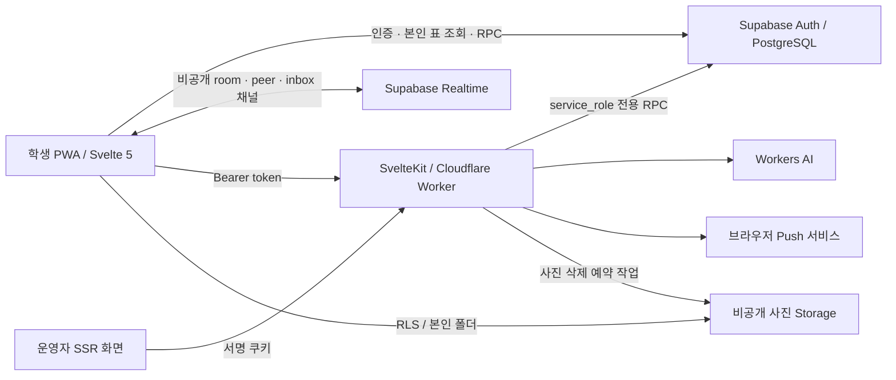

# Landy 프로젝트 종합 검토

작성일: **2026-10-03 (KST)** · 검토 기준 커밋: `28db29c` · 대상: CNSATINDER 저장소의 현재 작업 트리

**후속 코드 변경:** 이 문서의 발견은 수정 전 상태를 기록한다. 같은 날 반영한 업그레이드, 검증 결과, 부분 반영 및 운영 확인 항목은 [UPGRADE-2026-10-03.md](./UPGRADE-2026-10-03.md)에 정리했다.

추가 검토: **Supabase 플러그인 설치·활성화 확인 및 로컬 DB 심층 검증**. 운영 DB 접속 성공은 확인하지 못했다. 새 검증과 R24–R29는 [9절](#9-supabase-심층-추가-검토)에 모았다.

이 문서는 프로젝트 구조, 코드 비효율성, 보안 경계, 운영 신뢰성, 기술 구조와 UI/UX 개선 의견을 모은 실행용 백로그다. 코드 변경 없이 소스와 로컬 테스트를 검토했다. **확인한 구현 문제, 조건부 위험, 측정이 필요한 개선 제안을 구분한다.** 우선순위는 보안 취약점 등급만을 뜻하지 않고, 사용자 피해와 운영 영향까지 포함한다.

## 1. 프로젝트 이해

### 서비스와 사용자 흐름

Landy는 학교 이메일로 인증한 학생이 사용하는 모바일 PWA다. 랜덤 채팅과 이름으로 받는 사람을 찾는 익명편지가 중심이며, 대화 상대를 기다리는 동안 AI 봇을 이용할 수 있다. 업적·CNSA 및 동아리 뱃지·매너 온도·공지·문의·신고 기능이 결합되어 있다.

| 영역 | 실제 흐름과 주요 구현 |
|---|---|
| 설치·인증 | 일반 브라우저는 설치 안내로 이동 → 학교 이메일 OTP/비밀번호 로그인 → 비밀번호·성별·선호·이름 온보딩. `src/routes/+layout.svelte`, `src/lib/state.svelte.ts`, `login`, `onboarding`, `install` |
| 계정·상태 | Supabase 인증 세션을 전역 상태에 반영하고, 프로필·설정·계정 정보를 조회한다. 계정 변경 시 generation을 바꾸고 캐시와 늦은 응답을 격리한다. `accountScope.ts`, `state.svelte.ts` |
| 매칭 | `request_match` RPC가 대기 상태 갱신과 배정을 처리한다. 프런트는 화면이 보일 때 적응형 간격으로 폴링한다. `seeker.svelte.ts`, `pollSeeker.svelte.ts` |
| 채팅 | 방 입장 확인 → 양쪽 입장/시청 상태에 따른 타이머 → 연장 투표와 단계별 힌트 공개 → 고정/종료/평가. 낙관적 메시지·Realtime·재연결을 `ChatRoom`, `MessageLedger`, `SupabaseTransport`로 분리한다 |
| 익명편지 | 이름 검색/추천 → 봉투와 서식 편집기 → 전송 → 수신자 열람/답장 → 보관함·폴더·삭제·차단·신고. 표는 `private`에 두고 `dm_*` RPC로만 접근한다. `src/lib/letters/*`, `src/routes/(app)/letters/*` |
| 프로필·보상 | 소개·관심사·MBTI·매칭 선호, 매너 온도, 업적과 교복 뱃지. 뱃지 사진 인증은 비공개 Storage 업로드 후 운영자가 심사한다 |
| 알림·PWA | 브라우저 푸시 구독, 메시지/공감/편지/개인 공지 발송, 서비스워커의 알림 묶음과 앱 내 이동, 해시 정적 자산 캐시. `push.ts`, `server/pushSend.ts`, `server/webpush.ts`, `static/sw.js` |
| AI·콘텐츠 안전 | DB 규칙 필터 + AI 검토 대기열 + 자동 신고. AI 대화는 DB가 계정 상태·턴·예산을 확인하고 Worker가 모델을 호출한다. `api/ai-chat`, `api/moderate`, `server/ai*.ts`, `mod_*`, `ai_chat_*` |
| 운영자 | `/admin`은 SSR이며 서명 쿠키와 매 요청 운영진 명단 재확인을 사용한다. 신고·제재·신원 열람·전체 대화·CSV·공지·문의·뱃지·설정·팀·감사 기록을 역할/권한별로 제공한다 |

### 기술 구조와 책임 경계



- **학생 화면 가드는 UX이고, 실제 권한 경계는 DB다.** 브라우저에서 Supabase를 직접 호출하므로 RPC·RLS·열 권한이 핵심이다.
- **익명성은 상대 식별 정보를 응답에 넣지 않는 구조에 의존한다.** 메시지는 `sender_seat`을 쓰고, 방의 사용자 연결과 이름 명단은 별도 경계에서 관리한다.
- **운영자 신원 열람은 별도 신뢰 영역이다.** 서버 전용 service role, DB의 운영자 권한 검사, 열람 감사 기록이 함께 필요하다.
- **데이터 정리는 두 경로다.** PostgreSQL의 `pg_cron`과 Cloudflare의 사진 정리 예약 작업을 각각 운영해야 한다.
- 학생 앱의 SPA 구조는 제품 특성에 맞는다. 공개 문서·설치 안내의 최초 표시를 개선할 수는 있지만, 전체를 SSR로 바꾸는 것이 이번 검토의 우선 과제는 아니다.

### 규모와 검토 범위

로컬에서 확장자가 코드/SQL인 파일을 계산하면 `src` 239개·34,581줄, `scripts` 52개·8,969줄, `supabase` 3개·10,673줄이다. 빈 줄·주석을 포함한 수치이며 생성물·패키지·폰트·이미지는 제외했다. `schema.sql`은 6,673줄, `ChatView.svelte`는 1,303줄, `Envelope.svelte`는 1,135줄이다.

구조와 라우트 목록 전체를 확인하고, 인증·서버 API·운영자·매칭·채팅·편지·사진·알림·디자인 토큰·스키마/마이그레이션·테스트/CI를 중심으로 상세 검토했다. 모든 화면을 실제로 실행하거나 모든 소스 줄에 대해 전수 감사를 한 것은 아니다. `.env` 및 학생 명단 원본의 내용, 운영 DB·실계정·운영 로그·실제 배포 환경은 조회하지 않았다. 디자인 피드백은 코드와 UX 지침을 기준으로 하며, 실기기 사용성 검증과 시각 평가는 별도다.

## 2. 좋은 기반과 이미 해결된 문제

- `MessageLedger`의 전송 UUID와 DB unique index가 낙관적 전송·응답·Realtime 중복을 병합한다. 확정 메시지를 늦은 오류로 실패 상태로 되돌리지 않는 설계도 좋다.
- `ChatTransport` 추상화와 가짜 전송 계층 덕분에 네트워크와 화면 로직을 분리해서 검사할 수 있다.
- `accountScope`와 루트의 `{#key S.accountVersion}`은 계정 변경 후 늦은 응답·캐시 혼입을 방어한다.
- 학생 조회의 명시 컬럼, private 표의 RPC 접근, room 채널 쓰기 금지와 peer 채널 분리는 익명성과 데이터 무결성의 좋은 기반이다.
- 운영자 쿠키는 HMAC·HttpOnly·SameSite strict를 사용하며, 권한은 쿠키에 고정하지 않고 DB 명단에서 재확인한다.
- 신원 열람을 기록한 뒤 조회하는 구조, CSV 수식 주입 방지, 허용된 푸시 endpoint 검사는 유지할 가치가 있다.
- UX 지침, 화면 시나리오 테스트, 요청 예산 테스트, 보안 회귀 테스트, PGlite 스키마 테스트와 GitHub CI가 이미 있다. 테스트 도입부터 다시 시작할 프로젝트가 아니다.

`SECURITY-REVIEW-2026-10-02.md`의 최초 발견 사항은 **후속 수정 상태로 읽어야 한다.** 현재 코드에는 AI 매 턴의 제재 검사, AI 예산 잠금, Storage 업로드 총량/일일 한도, 사진 원장·삭제 임대·예약 재시도, 기존 사진 복구 마이그레이션이 있다. 이를 미해결 취약점으로 재기재하지 않았다. 다만 운영 환경에 실제 반영되었는지는 이번 검토에서 확인하지 않았다.

## 3. 우선순위별 개선 목록

P1 = 다음 개선 작업에서 우선 처리 · P2 = 계획된 개선에 포함 · P3 = 측정/제품 판단 후 정리. P0에 해당하는 즉시 악용 가능한 치명적 취약점은 이번 검토에서 입증하지 못했다.

| ID | 우선순위 | 영역 | 핵심 피드백 | 근거 수준 |
|---|---|---|---|---|
| R01 | P1 | 보안 정책·운영 | CSP가 뱃지 제출 사진의 출처를 허용하지 않음 | 코드 확인, 별도 출처 조건 |
| R02 | P1 | 안정성 | 초기 계정 조회 실패 뒤 같은 계정 재시도와 복구가 부족함 | 코드 확인 |
| R03 | P1 | 데이터 보존·UX | 편지·소개 초안 보존 지침과 구현이 다름 | 코드 확인 |
| R04 | P1 | 콘텐츠 안전·운영 | AI 검토 대기열 처리 시작이 학생 호출에 의존함 | 코드 확인 |
| R05 | P1 | 정보 안내 | 개인정보 안내가 사진·CSV·AI 처리의 실제 동작을 충분히 설명하지 않음 | 문서/코드 비교 |
| R06 | P2 | 알림 | 푸시 발송 예약과 실제 성공 기록이 분리되지 않음 | 코드 확인 |
| R07 | P2 | UX·정확성 | 대화 나가기 실패를 숨기고 확인 창을 먼저 닫음 | 코드 확인 |
| R08 | P2 | 계정 보안 | 비밀번호 재확인은 프런트만으로 강제할 수 없음 | 운영 설정 확인 필요 |
| R09 | P2 | 운영자 보안 | 운영자 쿠키를 개별 세션 단위로 폐기하기 어려움 | 설계 확인 |
| R10 | P2 | 비용·API | 요청 원문 크기 제한과 호출자별 요청 제한이 부족함 | 코드 확인, 외부 제한 미확인 |
| R11 | P2 | AI 안전 | 클라이언트의 assistant 기록을 시스템 지시문에 결합함 | 코드 확인, 모델 악용 미재현 |
| R12 | P2 | 사진 개인정보 | 이미지 디코딩 실패 시 원본 메타데이터가 남을 수 있음 | 조건부 코드 경로 |
| R13 | P2 | 성능 | 고정 채팅의 전체 기록 로딩·전체 정렬·전체 렌더링 | 코드 확인, 성능 측정 필요 |
| R14 | P2 | 요청 비용 | inbox 이벤트마다 대화 목록 전체를 다시 조회함 | 코드 확인, 부하 측정 필요 |
| R15 | P2 | 상태 일관성 | 대표 뱃지 연속 재배치의 응답 순서 제어가 없음 | 코드상 경쟁 조건 |
| R16 | P3 | 요청 비용 | 편지 목록을 낙관적으로 갱신한 뒤 세 종류를 다시 조회함 | 코드 확인 |
| R17 | P2 | 배포·PWA | 앱 셸과 캐시 버전의 갱신 주기가 어긋날 수 있음 | 조건부 배포 위험 |
| R18 | P2 | 접근성 | 확대 제한과 제한적인 글자 크기 설정 | 코드 확인, 실기기 검증 필요 |
| R19 | P2 | 디자인·접근성 | 일부 테마·서식 색의 대비가 부족함 | 정적 색상 계산 |
| R20 | P2 | 접근성 | 신고 선택·편집기 토글·사진 확대의 의미 전달 보완 | 코드 확인 |
| R21 | P2 | 유지보수 | 큰 화면 파일과 누적 SQL 변경의 책임을 정리할 필요 | 구조 개선 제안 |
| R22 | P2 | 검증 | 실제 PostgreSQL 동시성·배포 빌드·통합 경로의 검증 공백 | 테스트/CI 확인 |
| R23 | P2 | 내보내기 | CSV 여러 조각의 조회 시점과 날짜 검증이 일관되지 않음 | 조건부 코드 경로 |
| R24 | P2 | DB 권한 | `signup_stats`에 불필요한 TRUNCATE 권한이 남고 행 소실 시 편지 잠금이 풀림 | 로컬 역할 전환·재현, 운영 ACL 미확인 |
| R25 | P2 | 운영·자격 검증 | AI 시작·턴 승인이 점검 모드와 온보딩 상태를 검사하지 않음 | 로컬 재현 |
| R26 | P2 | AI 신뢰성·비용 | 같은 턴의 재시도가 한도와 모델 호출을 중복 소비할 수 있음 | DB 반복 호출 재현·서버/클라이언트 대조 |
| R27 | P2 | DB 성능 | 외래 키 3개에 전체 행을 포함하는 선두 인덱스가 없음 | 로컬 카탈로그 확인, 운영 부하 미측정 |
| R28 | P2 | 동시성 | 편지 폴더 30개 제한의 검사와 생성이 직렬화되지 않음 | 코드상 경쟁 조건, 복수 연결 재현 필요 |
| R29 | P2 | Realtime 권한 | 종료된 방의 제재 계정에도 신규 채널 참여 판단이 true | 로컬 권한 함수 재현, WebSocket 미검증 |

## 4. 안정성·보안·운영 상세

### R01 — CSP와 제출 사진 표시가 충돌한다

**근거:** `vite.config.ts:50`의 `img-src`는 `self`, `data:`, `blob:`만 허용한다. `src/routes/admin/badge-requests/+page.server.ts:28`은 Supabase `createSignedUrls` 결과를 넘기고, 같은 폴더의 `+page.svelte:70`과 `:109`는 URL을 ``에 직접 넣는다.

앱 도메인과 Supabase Storage 도메인이 다르면 서명 URL이 유효해도 브라우저가 이미지 요청을 차단한다. `connect-src`에 Supabase가 있어도 ``의 출처 허용을 대신하지 않는다. 운영자가 인증 근거를 볼 수 없어 심사가 막힌다. 실제 운영 브라우저에서 재현한 결과가 아니라, 현재 CSP와 렌더링 코드의 확정적 불일치다. [MDN img-src 설명](https://developer.mozilla.org/en-US/docs/Web/HTTP/Reference/Headers/Content-Security-Policy/img-src)

**개선:** 사용하는 Supabase Storage의 정확한 origin을 이미지 정책에 추가하거나, 권한·감사·no-store를 갖춘 동일 출처 사진 제공 경로를 사용한다. 전체 `https:` 허용으로 넓히지 않는다. CSP 수정과 함께 10분 뒤 서명 URL 만료 시 재발급 및 이미지 로딩 실패 안내도 마련한다.

**완료 기준:** 배포 빌드의 인증된 운영자 화면에서 사진 썸네일/확대가 표시되고 CSP 위반이 없다. 사진 URL 만료는 복구할 수 있고, 권한 없는 사용자는 볼 수 없다.

### R02 — 초기 조회 실패를 정상적인 재시도로 복구하기 어렵다

**근거:** `src/lib/state.svelte.ts:117`은 조회 전에 `loadedFor = uid`로 표시한다. `loadProfile:136`, `loadSettings:165`, `loadAccount:185`는 SDK의 `error`를 처리하지 않고 `data`만 반영한다. 홈의 `src/routes/(app)/+page.svelte`는 프로필이 없으면 비활성 버튼으로 다시 열라는 안내를 보여준다.

잠깐의 네트워크 실패가 계정 정보 없음으로 바뀌고, 같은 계정의 `SIGNED_IN`은 `loadedFor`에 걸려 초기 조회를 다시 수행하지 않는다. `init:63` 역시 ticker를 먼저 만든 뒤 초기 세션을 기다리므로 예외가 발생하면 재호출이 ticker 가드에 막힐 수 있다. SDK 오류 반환과 Promise 예외를 각각 다뤄야 한다.

**개선:** 부팅을 `idle/loading/ready/error`로 관리하고 성공한 데이터에만 freshness를 기록한다. SDK 오류를 명시적으로 검사하며, 필수 데이터 실패 시 같은 화면에 재시도 버튼을 둔다. 진행 중 Promise를 공유하고 실패 시 재시도 가능한 상태로 돌린다. 설정/계정 실패를 기능이 꺼짐/이름이 필요 없음과 구분한다.

**완료 기준:** 첫 프로필·설정 조회를 실패시킨 뒤 앱 종료 없이 복구된다. 실패가 가입/온보딩 완료로 오인되지 않고, 같은 계정의 중복 요청도 생기지 않는다.

### R03 — 작성 중인 글이 화면을 떠나면 사라진다

**근거:** `docs/UX-GUIDELINES.md` G5.5는 사용자별 24시간 자동 초안을 요구한다. 그러나 `src/lib/letters/EnvelopeCompose.svelte:53`은 본문·서식을 컴포넌트 상태로만 보관한다. 새 편지에서 받는 사람을 다시 고르면 `{#if to}`가 해제되어 컴포넌트가 사라진다. `src/routes/(app)/me/+page.svelte:88`의 소개·관심사·MBTI도 페이지 로컬 상태다.

편지를 길게 쓰거나 소개를 고친 뒤 뒤로가기/다른 화면/새로고침을 하면 저장하지 않은 입력을 잃는다. 현재 `LetterEditor`는 초기 `body/fmt`를 Tiptap 문서로 복구하는 흐름도 마련되어 있지 않아, 저장소만 추가해서는 충분하지 않다.

**개선:** 새 편지/답장/프로필별 초안 저장·복구 계약을 만들고, 계정 ID·받는 사람/원본 편지 ID·만료 시각·서명·서식을 포함한다. 명시적 버리기와 전송 성공에서 지우고, 로그아웃/계정 전환에서 이전 사용자의 초안을 지운다. `LetterEditor`에 안전한 초기 문서 복원과 계정별 메모리 초안을 함께 연결한다. 본문이 기기에 남는 기능이므로 자동 만료와 삭제 정책도 함께 구현한다.

**완료 기준:** 500자 편지를 쓰고 탭 이동·뒤로가기·새로고침해도 복원된다. 계정을 바꾸면 이전 계정 초안이 노출되지 않는다. 전송 실패에서는 초안이 남고 성공에서만 제거된다.

### R04 — AI 검토 대기열의 진행이 학생 앱에 의존한다

**근거:** `src/lib/moderation.ts`는 글 전송 뒤 지연 호출하며 실패 시 다음 글에서 재시도한다. `src/routes/api/moderate/+server.ts`는 인증된 학생 요청에서 5개를 claim한다. `scripts/cloudflare-worker.mjs`의 예약 작업은 사진 정리만 수행한다. `supabase/schema.sql`의 `mod_claim`은 하루 지난 미처리 작업을 skipped로 바꾼다.

클라이언트 호출을 생략하거나 마지막 작성자가 바로 앱을 닫고 후속 작성도 없으면, DB에 들어간 검토 작업을 수행할 주체가 없다. 규칙 필터는 계속 작동하지만 **AI가 필요한 콘텐츠를 검사한다는 기대는 충족되지 않을 수 있다.** 대기열이 쌓였을 때 처리량 역시 후속 이용자 호출량에 좌우된다.

**개선:** 서버의 정기 작업/큐 소비자가 대기열을 처리하도록 하고, 학생 호출은 빠른 실행 힌트로만 사용한다. 기존 예산 잠금·lease·재시도 규칙을 재사용한다. 가장 오래된 pending의 나이, 실패·skipped 수, 처리 지연을 운영 화면과 로그로 관찰한다. `waitUntil(work.catch(() => {}))`에서 예상 밖 오류까지 숨기지 말고 원문 없이 작업 ID와 오류 종류를 기록한다.

**완료 기준:** 학생 후속 호출 없이도 마지막 글이 검토된다. AI 한도/장애 시 대기와 실패가 운영자에게 구분되어 보이며, 중복 처리와 예산 초과가 없다.

### R05 — 개인정보 안내와 현재 기능이 충분히 맞지 않는다

**근거:** `src/lib/legal.ts`의 개인정보 수집·보관 항목에는 뱃지 증빙 사진과 동아리 부원 학번 목록이 구체적으로 없다. 관리자 CSV 파일의 보관 가능성 및 DB 삭제와 파일 삭제의 차이도 설명하지 않는다. AI는 맡기는 곳에 이름으로 나오지만, 콘텐츠 검토에 원문과 주변 맥락이 전달되는 흐름은 구체적으로 드러나지 않는다. 정책 갱신일은 2026-09-26이다.

**개선:** 수집 항목과 실제 보관/삭제 구현을 하나의 데이터 목록으로 대조한다. 사진 심사·미제출 정리·삭제 실패 재시도, CSV의 운영자 보관, AI에 보내는 내용과 저장 여부를 평이하게 안내한다. 비밀번호는 복호화 가능한 암호화가 아니라 해시 저장이라는 용어로 정리한다. 기록 수치도 대표 뱃지 슬롯 등 현재 설정과 맞춘다. 이는 **구현과 안내의 정합성 검토이며, 법적 적합성 판단은 아니다.**

**완료 기준:** 모든 실제 수집 데이터에 목적·열람 주체·보관·삭제 경로를 대응시킬 수 있다. 제출 화면의 짧은 안내와 전체 정책이 일치한다.

### R06 — 푸시는 한 번 실패하면 다시 보내기 어렵다

**근거:** `supabase/schema.sql`의 `push_payload`, `dm_push_payload`는 발송 전에 중복 방지 로그를 삽입한다. `src/lib/server/pushSend.ts`는 발송 결과 중 성공 수와 404/410 구독만 처리하고 일시적 오류를 재예약하지 않는다. `src/lib/push.ts`는 전송 뒤 API 호출 실패를 조용히 끝낸다.

현재 로그는 실제 전달 성공보다 “발송 시도 예약”에 가깝다. Push 서비스가 일시적으로 실패하면 API 재호출이 `already`로 끝난다. 메시지 저장 후 클라이언트가 API를 부르지 못하면 발송 시도 자체도 없다. 채팅/편지 데이터는 저장되므로 데이터 유실과 알림 유실을 구분해야 한다.

**개선:** DB 커밋에서 발송 작업을 함께 기록하고 서버가 처리하는 outbox를 도입한다. 기기별 작업 ID·lease·시도 횟수·다음 시각·최종 결과를 관리하고 TTL 이내의 일시적 실패만 재시도한다. 같은 알림의 중복 방지와 성공/최종 실패 기록을 분리한다. 재시도 시 수신자의 현재 열람·차단·mute도 재확인한다.

**완료 기준:** 503/timeout 후 재시도되고 404/410은 구독 정리로 종료된다. 서버 중단 후 재개해도 작업이 남으며 무제한 중복 알림은 생기지 않는다.

### R07 — 대화 나가기와 실패 상태가 일치하지 않는다

**근거:** `src/lib/chat/ChatView.svelte:206`은 `leave: () => void room?.leave(false)`로 Promise를 버린다. `src/lib/chat/room.svelte.ts:441`은 RPC 실패를 삼킨다. `block:431` 역시 요청 성공 전에 `endedByMe`를 바꾼다. `RoomActions.svelte`는 반환값이 false가 아니면 완료 경로로 간다.

오프라인에서 나가기를 눌러도 시트가 닫히고 종료 이유 상태가 바뀔 수 있지만 서버에는 열린 방이 남는다. 실패한 차단도 이후 실제 종료 문구에 영향을 줄 수 있다. `skip()`은 실패를 구분하지 않고 새 찾기 화면으로 이동한다.

**개선:** `leave/block`의 결과를 명시적으로 반환하고 실패 시 UI를 유지하거나 롤백한다. `endedByMe`는 서버 성공 이후 확정한다. 사용자에게 실패 이유와 재시도를 보여주고, “이미 종료”는 정상 완료로 처리하되 네트워크 실패와 구분한다.

**완료 기준:** 네트워크를 끊고 나가기/차단/건너뛰기를 실행해도 성공처럼 보이지 않는다. 복구 후 같은 작업을 재시도할 수 있다.

### R08 — 비밀번호 재확인 규칙은 Auth 서버 설정까지 확인해야 한다

**근거:** 설정 화면은 `recentlyVerified()`와 재확인 단계로 UX를 제공한다. 하지만 `src/lib/state.svelte.ts:363`의 최종 저장은 `supabase.auth.updateUser({ password })`이며 `nonce/current_password`를 전달하지 않는다. 브라우저 상태의 10분 기록은 서버가 검증하는 증거가 아니다.

탈취된 유효 세션이 있으면 UI를 거치지 않고 Auth API를 호출할 수 있다. 실제 허용 여부는 Supabase의 비밀번호 변경 재인증 설정에 달려 있어 **운영 취약점으로 확정하지 않았다.** 공식 문서의 recent-session 조건도 이 UI의 10분 규칙과 같지 않다. [Supabase 비밀번호 보안](https://supabase.com/docs/guides/auth/password-security)

**개선:** 서버가 강제하는 정책을 먼저 결정하고 그에 맞게 재인증 nonce 또는 현재 비밀번호를 최종 요청에 포함한다. 최초 비밀번호 설정과 OTP 복구도 함께 설계한다. 프런트만 확인한 채 보안이 강제된 것으로 문서화하지 않는다.

**완료 기준:** UI를 우회한 오래된 세션의 직접 비밀번호 변경이 정책대로 거부된다. 정상 신규 설정·변경·복구는 모두 작동한다.

### R09 — 운영자 쿠키의 개별 폐기와 추가 인증을 보완할 수 있다

**근거:** `src/lib/server/adminSession.ts`의 쿠키 payload는 사용자 ID·8시간 만료·서명이다. Supabase 인증 세션 ID나 개별 폐기 ID가 없다. `hooks.server.ts`는 현재 운영진 명단을 재확인하므로 역할 제거는 즉시 적용되지만, Auth 세션 로그아웃/비밀번호 변경과 관리자 쿠키는 별도다.

**개선:** 관리자 세션 ID와 DB의 개별 폐기 상태 또는 사용자별 session version을 연결한다. 필요 시 전체 신원 열람·CSV·운영진 변경 같은 고권한 작업에 MFA/재인증을 적용한다. 현재 명단 재확인은 그대로 유지한다. 추가로 `/admin/session`의 JSON POST에 Content-Type/Origin을 명시적으로 검증하면 요청 계약이 분명해진다. 현재 SvelteKit에는 폼 형식 요청의 출처 검사도 있으므로 CSRF 방어가 없다는 지적은 아니다. JSON 본문 자체가 preflight를 항상 강제하는 것은 아니므로 해당 주석은 실제 Content-Type과 프레임워크 방어를 구분해 설명한다. 이번 검토에서 CSRF 악용은 입증하지 않았다.

**완료 기준:** 특정 운영자 세션만 폐기할 수 있다. 인증 세션 만료/비밀번호 변경 시 관리자 쿠키가 어떻게 처리되는지 정책과 테스트가 일치한다.

### R10 — 정제 후 크기 제한과 원문 요청 제한은 다르다

**근거:** `src/lib/server/request.ts`의 `jsonObject`는 본문 전체를 파싱한다. `server/aiChat.ts:27`은 배열 전체를 filter/map한 뒤 마지막 20개를 선택한다. AI·moderate·push API에 애플리케이션 수준의 호출자별 rate limit은 보이지 않는다. DB의 턴·예산 제한은 이미 있지만 요청 파싱과 인증/RPC 비용 자체를 막지는 않는다.

**개선:** 실제 본문을 읽는 단계에서 적절한 byte 상한을 적용하고 413을 반환한다. `Content-Length`만 믿지 않는다. AI 기록은 허용 배열 길이를 먼저 검사하고 필요한 구간만 정제한다. endpoint별 계정 기반 제한과 동시 요청 제한을 두고 429 및 재시도 시각을 반환한다. 학교 공용 IP를 고려하여 IP 단독 제한으로 학생 전체를 막지 않는다. 플랫폼의 기존 제한과 중복 여부도 먼저 확인한다.

**완료 기준:** 큰 배열/긴 token/잘못된 JSON을 제한된 비용으로 거절하고, 정상 입력은 유지된다. 초과 호출이 모델 실행 전에 차단된다.

### R11 — 신뢰하지 않는 AI 기록을 시스템 지시문에 넣지 않는다

**근거:** `src/lib/server/aiChat.ts:42`는 앞쪽 assistant 메시지를 `SYSTEM` 문자열에 “네가 먼저 한 말”로 붙인다. `cleanHistory`는 role과 문자열 형식만 확인하므로 해당 assistant 텍스트도 호출자가 정할 수 있다. `tidyReply:66`는 일부 전화번호/@아이디 제거와 길이 제한만 수행한다.

조작한 이전 답변을 지시문과 같은 위치에 올려 모델이 신뢰하게 만드는 경로다. DB가 전체 입력의 금칙 정보를 검사하는 보호는 존재하지만, 프롬프트의 신뢰 경계를 대신하지 않는다. 실제 모델의 유해 응답이나 데이터 유출을 재현한 것은 아니다.

**개선:** 봇의 초기 인사는 서버가 정한 값으로 두고 사용자 제공 기록은 시스템 영역에서 분리한다. 기록을 보존하지 않는 설계를 유지하려면 서버 서명 기록 또는 신뢰하지 않는 대화 데이터 취급을 검토한다. 출력에도 필요한 규칙 검사를 적용하고, 역할 위조·우회 지시·유해 출력 시나리오로 평가한다. 단순 키워드 필터가 완전한 모델 안전 보장이라는 가정은 피한다.

**완료 기준:** 조작한 assistant 기록이 system 메시지에 결합되지 않는다. 안전 시나리오를 실제 모델별로 검사하고 실패 시 보여줄 대체 안내가 있다.

### R12 — 이미지 원본 fallback은 메타데이터 제거를 보장하지 않는다

**근거:** `src/lib/badgeRequests.ts`의 `shrink`는 canvas JPEG 변환을 시도하지만, 디코딩 실패 후 MIME/5MiB 조건을 만족하면 원본 File을 반환한다. API 직접 업로드에서도 클라이언트 변환은 강제되지 않는다.

**개선:** 개인정보가 담긴 증빙 이미지에 대해 서버/업로드 처리 단계에서 디코딩·메타데이터 제거·허용 형식을 보장한다. EXIF 위치/기기 정보를 가진 합성 이미지를 써서 검증한다. 앱에서 변환하지 못하면 원본을 조용히 보내지 말고 다른 사진을 선택하게 하는 방법도 있다. 기존 비공개 버킷·총량 제한·삭제 원장은 유지한다.

**완료 기준:** 변환 실패와 직접 API 업로드에서도 저장 이미지에 불필요한 원본 메타데이터가 남지 않는다. 이 경로의 실제 EXIF 노출은 아직 재현하지 않았다.

## 5. 코드 효율성과 기술 구조 상세

### R13 — 고정 채팅은 페이지 제한이 있어도 전체 기록을 받는다

**근거:** `src/lib/chat/supabase-transport.ts`의 `fetchAfter`는 200개씩 반복해 모든 행을 배열로 합친다. 최초 커서는 0이다. `message-ledger.svelte.ts`의 `upsert`는 매번 전체 배열을 sort한다. `ChatView.svelte:636`은 `room.msgs` 전체를 렌더링한다. 고정 방은 시간 상한이 없어 기록이 커질 수 있다.

**개선:** 처음에는 최신 메시지 구간을 받고 위로 스크롤할 때 과거를 읽는다. batch 병합에서는 한 번 정렬하고, 일반 append/상태 갱신에서는 재정렬을 줄인다. 일정 규모 이상에서 DOM 가상화를 검토하되 답장 대상 이동·스크린리더·삭제 반영을 같이 유지한다. 무조건 도입하기 전에 100/1,000/10,000행으로 비교한다.

**완료 기준:** 큰 방 최초 진입의 요청 수·응답량·DOM 수·렌더 시간 상한을 정하고 충족한다. 과거 조회 중 메시지 중복/누락이 없으며 답장 인용 이동도 작동한다. 실제 지연 수치는 아직 측정하지 않았다.

### R14 — inbox의 300ms debounce는 지속 대화의 전체 조회를 줄이지 못한다

**근거:** `src/lib/inbox.svelte.ts:132`는 changed 신호 뒤 300ms 후 `my_rooms` 전체를 다시 읽는다. SQL `my_rooms`는 방별 마지막 메시지 및 unread count를 계산한다. 몇 초 간격으로 대화하면 각 이벤트가 별도 전체 조회가 된다. 요청 sequence가 오래된 응답 적용은 막지만 실제 요청을 취소하거나 공유하지는 않는다. 60초 안전 폴링도 추가된다.

**개선:** ID 없는 현재 신호는 그대로 두더라도 최소 재조회 간격과 inflight 공유를 적용할 수 있다. 이후에는 신원 없는 room 단위 버전/변경 정보를 보내 부분 갱신하고 주기 전체 조회로 보정한다. 먼저 이벤트→RPC 요청 수와 SQL 실행 계획을 측정한다. `messages_cursor(room_id, id)` 등 기존 인덱스가 있으므로 인덱스부터 무조건 추가하지 않는다.

**완료 기준:** 활발한 대화·읽음·방 전환 시 RPC 수의 예산을 정한다. unread/순서/온라인 상태는 갱신되고 계정 전환 응답 격리는 유지된다.

### R15 — 대표 뱃지 재배치의 늦은 응답이 최신 배치를 덮을 수 있다

**근거:** `src/routes/(app)/me/+page.svelte:67`의 `place`는 낙관적으로 배치를 바꾸지만 직렬화나 요청 sequence 확인 없이 각 RPC 응답의 featured를 적용한다. 실패 시 이전 `fame`을 복원한다. 두 번의 변경이 겹치면 늦은 첫 성공 또는 첫 실패가 두 번째 변경을 덮을 수 있다. `toggleFeature`의 busy 방어와 별도 흐름이다.

**개선:** 재배치 요청을 직렬화하고 대기 중 마지막 의도만 보내거나, 요청 번호/서버 버전으로 최신 변경만 반영한다. UI 응답만 걸러서는 서버 최종 저장 순서까지 해결되지 않으므로 저장 정책도 함께 정한다. 실패 롤백은 그 요청 이후 변경이 없을 때만 한다.

**완료 기준:** 연속 배치 요청의 응답 순서를 역전시키거나 첫 요청만 실패시켜도 최종 UI와 다시 읽은 DB 순서가 일치한다.

### R16 — 편지 조작 후 전체 재조회 범위를 줄일 수 있다

**근거:** `src/lib/letters/mailbox.svelte.ts`의 `filed/dropThread`는 목록을 즉시 갱신한 뒤 `refreshMailbox → reloadMailbox`에서 받은 편지·보낸 편지·unread를 모두 다시 읽는다. G13.4의 낙관적 변경 후 확인 조회를 줄이라는 원칙과 비교할 필요가 있다. 폴더 수 정합성을 맞추려는 이유는 타당하다.

**개선:** mutation RPC가 영향받은 편지/폴더 카운트/unread를 반환하도록 하거나 영향받은 box만 갱신한다. 계정/요청 sequence와 pagination 경계를 유지한다. 이 변경은 프로파일링 후 실행할 P3다.

**완료 기준:** 폴더 이동/삭제 한 번의 요청 수를 줄이면서 양쪽 보관함과 폴더 카운트가 일치한다.

### R17 — 서비스워커 버전과 배포 앱 셸을 함께 갱신해야 한다

**근거:** `static/sw.js`는 수동 `landy-v11` 버전을 쓰고 설치 시 `/`를 캐시한다. 네비게이션은 network-first지만 성공한 HTML을 캐시에 갱신하지 않는다. 코드 배포만 하고 SW 내용이 그대로면 오프라인 fallback의 이전 HTML이 계속 남을 수 있다. 그 HTML이 참조하는 이전 해시 자산이 캐시되지 않았거나 배포에서 제거됐으면 부팅 실패로 이어질 수 있다.

**개선:** 빌드 ID와 앱 셸 캐시를 연동하고, 앱 업데이트 표시와 안전한 새로고침 정책을 정한다. 오프라인에서 인증/실시간 기능이 제한되는 안내를 별도로 제공한다. 현재의 `/admin`·API·Supabase 응답 캐시 제외는 유지한다. 작성 중 글이 있는 상태에서 자동 reload하지 않도록 R03과 함께 설계한다.

**완료 기준:** 구버전 설치 → 새 빌드 배포 → 온라인/오프라인 전환에서 로딩이 깨지지 않는다. 작성 중 새 버전이 나타나도 글을 잃지 않는다.

### R21 — 큰 파일보다 책임 경계와 SQL 변경 이력을 먼저 정리한다

**근거:** `ChatView`는 1,303줄이며 제스처·스크롤·메시지·평가·메뉴·CSS가 결합되어 있다. `Envelope`는 1,135줄이다. `state.svelte.ts`는 인증·부팅·설정·온라인·설치까지 담당한다. `schema.sql`은 단계별 변경/재정의를 누적하며 별도 보안 마이그레이션과 일부 정의를 함께 유지한다.

**개선:** 채팅은 스크롤/답장 제스처/메시지 목록처럼 실제 책임으로 분리하고, 기존 transport/ledger 분리는 유지한다. 시각 연출의 SVG가 크다는 이유만으로 모든 조각을 컴포넌트로 만들지는 않는다. 계정 부팅과 온라인 lifecycle을 분리하면 R02의 복구 상태도 명확해진다. DB는 적용 순서가 있는 migration을 변경의 기준으로 두고 신규 설치 snapshot과 동등성을 자동 검사한다. RPC 입력/출력 타입과 역할별 허용 목록도 한 곳에서 관리한다.

**완료 기준:** 새 기능 수정 시 관련 모듈과 migration이 명확하며 snapshot/기존 DB 업그레이드의 차이가 테스트에서 잡힌다. 모든 화면의 동작과 요청 예산이 유지된다.

### R22 — 로컬 회귀 테스트 통과와 운영 통합 검증을 구분한다

**근거:** `.github/workflows/ci.yml`은 타입·단위/SQL·빌드와 브라우저 UI job을 갖췄다. UI runner는 주로 Vite dev 및 가짜 Supabase를 사용한다. PGlite와 보안 probe는 단일 연결이므로 실제 동시 트랜잭션을 재현하지 않는다. `test:e2e`, `test:match`는 실서버 계정 기반 스크립트이며 CI에서 제외되어 있다.

**개선:** 실제 PostgreSQL을 사용하는 격리된 통합 job에서 같은 사용자 매칭/메시지 제한/AI 예산/사진 업로드의 동시 요청을 검사한다. prod preview의 CSP·Storage 이미지·학생 설치 가드·Worker 예약 handler를 별도 smoke test로 검증한다. 실계정 명단 대신 합성 데이터를 쓴다. a11y suite에 확대·대비·폼 label·선택 상태·dialog 포커스를 추가한다. 신규 테스트는 R01/R02/R07/R15처럼 구체적인 실패를 잡는 것부터 만든다.

**완료 기준:** CI가 개발용 화면만이 아니라 실제 배포 정책 충돌도 잡는다. 동시성 검증 결과와 실기기 수동 확인은 각각 기록된다.

### R23 — CSV export의 조회 시점과 날짜를 더 엄격히 정의한다

**근거:** `src/routes/admin/rooms/+page.svelte`는 5,000행 조각을 여러 GET으로 받아 메모리에서 하나의 Blob으로 합친다. SQL `admin_export_messages`는 날짜와 `p_after`만 사용하며 고정 snapshot은 없다. export API의 날짜 검증은 `YYYY-MM-DD` 정규식과 `Date` 변환으로 이루어진다.

내보내는 동안 메시지 삭제/purge/새 커밋이 발생하면 조각들이 같은 시점의 백업이라고 보장할 수 없다. `2026-02-30`처럼 JS가 보정하는 날짜나 유효하지 않은 큰 월/일도 명시적 400 처리와 구분이 필요하다. 큰 범위 export의 브라우저 메모리도 측정 대상이다. CSV 수식 주입 방지와 조각별 감사 기록은 이미 존재한다.

**개선:** 조회 상한 ID·생성 시점·export job ID를 고정하고 “조회 기간의 추출본”인지 일관된 snapshot인지 요구를 정한다. 강한 snapshot이 필요하면 서버 작업으로 생성한다. 날짜를 실제 달력 값으로 검증하고 허용 범위/최대 기간을 둔다. 대용량은 진행률·중단·스트리밍/서버 파일 생성 방법을 검토한다.

**완료 기준:** 잘못된 날짜는 400으로 안내되고, export 중 데이터 변동 시 결과의 보장 범위가 명시된다. 대용량 export가 과도한 메모리를 사용하지 않는다.

## 6. 디자인·접근성 상세

### R18 — 확대 제한을 제거하고 글자 크기 설정의 적용 범위를 넓힌다

**근거:** `src/app.html:7`은 `maximum-scale=1`, `user-scalable=no`를 선언한다. `prefs.svelte.ts`와 `app.css`의 text 설정은 주로 대화/편지의 크기와 줄 높이를 바꾸며 제목·설정·버튼 등 다수 요소는 고정 px다. 가장 큰 채팅 글씨는 19px이다.

**개선:** 입력칸 16px 이상이라는 기존 원칙을 유지하면서 페이지 확대를 허용한다. 시스템 글자 확대·200% 확대에서 주요 화면과 시트를 검사하고, 디자인 토큰은 필요한 곳에 rem 기반 확대를 적용한다. 브라우저가 viewport 제한을 무시하는 경우도 있으므로 실제 기기별 결과를 확인한다. 앱 자체 글자 설정만으로 전체 200% 접근성을 충족한다고 간주하지 않는다. [W3C 텍스트 확대 기준](https://www.w3.org/WAI/WCAG22/Understanding/resize-text.html)

**완료 기준:** 로그인·설정·채팅·편지·운영자 주요 동작을 200%에서도 수행할 수 있고, 버튼/입력/시트가 잘리거나 겹치지 않는다.

### R19 — 테마와 서식 색의 실제 대비를 검사한다

**근거:** `themeColor.svelte.ts`는 테마 색을 버튼/말풍선/링크에 공용으로 적용한다. `letters/rich.ts`는 고정 서식 색을 사용한다. 다음은 코드의 단색 값을 sRGB 상대 휘도로 계산한 값이다. 실제 그라데이션·반투명 합성·배치의 최소 대비를 측정한 값은 아니다.

| 조합 | 계산 대비 | 해석 |
|---|---:|---|
| 흰 글씨 / 기본 그라데이션 밝은 끝 `#b56cf3` | 3.28:1 | 일반 크기 본문 기준 4.5:1에 못 미침 |
| 흰 글씨 / 파랑 `#3b8af6` | 3.41:1 | 일반 크기 본문 기준 미달 |
| 흰 글씨 / 초록 밝은 끝 `#5fd08a` | 1.93:1 | 큰 글씨 3:1 기준에도 못 미침 |
| 초록 accent `#22b38e` / 흰색 | 2.66:1 | 작은 링크·아이콘 확인 필요 |
| 편지 주황 `#f76b15` / 종이 `#fffaf0` | 2.86:1 | 읽는 글의 색으로 부족할 수 있음 |
| 편지 회색 `#8b8d98` / 종이 `#fffaf0` | 3.17:1 | 일반 본문 기준 미달 |

**개선:** 장식용/글자용/채운 면용 색을 분리하고 라이트·다크마다 대비를 만족하는 토큰을 둔다. 전체 테마 × 작은/일반 본문 × 서식 팔레트를 검사한다. 기존 `accent-fill-deep`도 실제 사용 위치를 확인한다. 손글씨는 장식과 실제 읽는 긴 편지를 구분하고 반듯한 글씨 전환을 가까이 둔다. [W3C 최소 대비 기준](https://www.w3.org/WAI/WCAG22/Understanding/contrast-minimum.html)

**완료 기준:** 일반 글씨 4.5:1, 큰 글씨 3:1을 기준으로 실제 렌더링 색을 검사하고 미달 조합을 제거한다. 모든 색상의 대비가 나쁘다고 일반화하지 않는다.

### R20 — 선택·토글·사진 확대의 의미를 보조기술에 전달한다

**근거:** `ui/ReportPicker.svelte`의 이유 선택은 CSS `class:on`만 있으며 radio/pressed 상태가 없다. 메모는 placeholder만 있고 명시적 label이 없다. 이유 버튼 높이는 34px로 자체 G1의 44px 규칙보다 작다. `letters/LetterEditor.svelte`의 굵게/기울임 등도 시각 활성화 상태와 `aria-pressed`가 연결되지 않는다. 운영자 뱃지 사진 확대 viewer는 presentation div이며 공용 dialog/focustrap을 사용하지 않는다.

**개선:** 신고 사유는 fieldset/radio 또는 적절한 선택 상태를 사용하고 textarea에 이름을 준다. 편집기 toggle에는 `aria-pressed`를 적용하며 toolbar 키보드 이동을 정한다. 사진 확대는 이름·닫기 버튼·포커스 이동/복귀를 갖춘 dialog로 만든다. 이유 버튼은 실제 눌림 영역을 44px로 확보한다. 44px은 프로젝트 목표이고 WCAG의 모든 target 기준과 동일하다고 표현하지 않는다.

**완료 기준:** 화면 낭독기로 선택한 이유와 활성 서식을 알 수 있다. 키보드만으로 사진 확대/닫기가 가능하고 포커스가 원래 버튼으로 돌아온다. 확대·스크롤 중 주변 버튼을 오작동시키지 않는다.

### 제품 디자인 제안 — 기존 장점을 유지하며 조정할 부분

이 절은 버그 판정이 아니라 사용자 조사와 제품 판단이 필요한 제안이다.

1. **설치 전에 가치를 먼저 보여준다.** 현재 설치 게이트는 비로그인 정책/소개 화면도 함께 막는다. 짧은 서비스 소개·익명성 범위·안전 기능·약관/개인정보 안내를 설치 전에 볼 수 있게 하면 설치 결정을 돕는다. 푸시를 위해 설치가 필요한 동작은 현재 안내를 활용한다.
2. **편지 연출과 접근 속도를 함께 제공한다.** 우체통·봉투·교복은 제품의 개성이다. 다만 알림에서 특정 편지를 확인할 때도 우체통 장면을 거치므로, 기존 `PREFS.envelope`와 reduced motion을 바탕으로 읽기 속도/건너뛰기/닫기 동작을 실기기에서 평가한다.
3. **신고·차단의 결과를 짧고 확실하게 설명한다.** 익명성을 위해 상대에게 원인을 숨기는 정책은 유지하면서 신고자 본인에게는 접수/차단 완료/연결 실패를 정확하게 전달한다. 오류를 2줄 토스트에만 두면 읽기 전에 사라지므로 중요한 실패는 해당 화면에 남긴다.
4. **우클릭과 개발자 도구 단축키 차단을 제거하는 것을 검토한다.** 루트 layout의 production 이벤트 차단은 익명성 경계가 아니며 복사·브라우저 기능·문제 진단의 마찰을 만든다. 보안 투자는 RLS/RPC와 운영 권한 검증에 둔다.
5. **브랜드·설계 문서를 현재 구현에 맞춘다.** Landy/랜디/CNSATINDER/simbun 표기, 기본 보라색과 과거 주황 설명, README의 외부 개인 계획 경로 및 존재하지 않는 `schemaCompatibility.ts` 설명을 정리한다. 기존 저장소 이름·Storage 키까지 일괄 변경할 필요는 없으며 사용자 표기와 개발 안내부터 일치시키면 된다.

## 7. 실행 순서와 검증 계획

### 1차: 사용자가 바로 겪는 실패와 운영 공백

- R01 CSP/사진 표시 및 만료 복구
- R02 부팅 오류 상태와 재시도
- R03 계정별 초안 저장/복원
- R04 서버 주도 AI 검토 처리
- R05 실제 데이터 처리와 정책 안내 정합성
- 함께 처리하면 좋은 작은 수정: R07 나가기 실패 전달, R20 신고 선택/label

### 2차: 신뢰성과 접근성

- R06 푸시 outbox와 실패 관찰
- R08 Auth 서버 재인증 정책 확인, R09 관리자 세션 폐기
- R10 요청 상한, R11 AI 기록 신뢰 경계, R12 사진 메타데이터
- R17 PWA 갱신 정책, R18 확대, R19 대비
- R15 뱃지 재배치 순서, R23 export 요구 명확화
- 추가 DB 검토: R24 최소 권한/잠금 실패 기본값, R25 점검 경계, R26 AI 요청 중복 방지, R29 종료 후 채널 권한

### 3차: 측정 결과를 바탕으로 성능·구조 정리

- R13 메시지 페이지/병합/렌더링 최적화
- R14 inbox 요청 budget, R16 편지 재조회 범위
- R21 책임별 코드와 migration 관리
- R22의 동시성/production smoke test를 각 수정의 완료 조건과 연결
- R27 외래 키 인덱스는 운영 실행 계획을 확인해 적용하고, R28 폴더 상한은 복수 DB 연결에서 검증

### 권장 검증 시나리오

| 시나리오 | 확인할 결과 |
|---|---|
| 로그인 첫 조회 실패 → 재시도 | 재부팅 없이 프로필·설정 복구, 중복 요청 없음 |
| A 계정 초안 → 로그아웃 → B 계정 | A의 글/서명/받는 사람/캐시가 보이지 않음 |
| 마지막 메시지 작성 후 앱 종료 | 후속 학생 없이 서버가 검토 대기열 처리 |
| Push 503/timeout → 복구 | TTL 안에서 재시도, 기기별 중복 제한 |
| 오프라인 나가기/차단 | 성공 표시 없음, 연결 복구 후 재시도 가능 |
| 운영자 사진 심사 | production CSP 허용, URL 만료 복구, 권한/캐시 경계 유지 |
| 동시 AI/사진/매칭 요청 | 예산·상한·중복 불변식 유지, 실제 PostgreSQL에서 확인 |
| 10,000행 고정 채팅 | 최초 응답량·DOM·렌더 시간·과거 조회 성능 측정 |
| iOS/Android PWA, 360px, 다크, 200%, reduced motion | 입력·시트·알림 이동·글 보존·확대·명도 대비 확인 |
| 구버전 앱에서 새 빌드로 갱신 | 오프라인 셸 정상, 작성 중 내용 보존 |

## 8. 이번 검토에서 실제 실행한 검증과 한계

| 검사 | 결과 |
|---|---|
| `npm test` | **통과, exit code 0.** unit 하위 스위트와 security 회귀·사진 삭제 테스트, SQL **1,077 passed / 0 failed** 포함 |
| `npm run check` | **완료하지 못함.** Vite/SvelteKit이 `.env`를 읽는 과정에서 sandbox `EPERM` 발생. 코드 타입 오류 판정이 아님 |
| 색상 대비 계산 | 위 R19의 소스 색상을 sRGB 공식으로 정적 계산. 브라우저 합성/스크린샷 평가는 미실행 |
| build / Worker deploy dry-run / 브라우저 UI suite | 이번 검토에서 미실행. 이전 보안 문서의 성공 기록은 이번 실행 결과로 계산하지 않음 |
| npm audit | 이번 검토에서 재실행하지 않음. 현재 registry 기준 취약점 0건을 보증하지 않음 |
| 실제 Supabase·Storage·Realtime·Workers AI | 이번 검토에서 접속/변경하지 않음 |
| 운영 Auth/CSP/cron/secret 및 migration 적용 여부 | 운영 설정 확인 필요 |
| Supabase 플러그인 메타데이터 | **설치됨·ENABLED·GLOBAL 확인.** 현재 도구 목록에 Supabase 조회 도구 없음. 프로젝트/OAuth 연결 성공은 미확인 |
| 로컬 PostgreSQL 카탈로그 및 추가 재현 | PGlite에 현행 SQL과 Supabase 테스트 스텁을 실행. 권한/RLS/함수/인덱스·R24/R25/R26/R29 확인. 실제 Supabase 서비스 결과와 구분 |
| snapshot → 보안 migration 함수 비교 | `schema.sql` 실행 후 `20261004020711_security_hardening_20261002.sql`을 적용해 기존 함수의 `pg_get_functiondef` 비교. 변경 함수 **0개**. 운영 적용 여부·전체 데이터 이행의 증거는 아님 |

테스트 통과는 기존 회귀 조건이 유지된다는 증거다. R01의 사진 표시, R03의 초안, 실제 PostgreSQL 경쟁 조건처럼 테스트가 직접 다루지 않는 흐름까지 증명하지는 않는다. 이번 문서의 보안 항목 중 서버 설정/세션 탈취/모델 응답을 전제로 하는 것은 그 조건을 함께 적었으며, 이를 이미 악용된 사고로 표현하지 않았다.

## 9. Supabase 심층 추가 검토

### 9.1 연결 확인 결과와 증거 범위

사용자가 Supabase 플러그인 연동과 직접 멘션을 제공한 뒤 설치 메타데이터를 확인했다. 플러그인 `supabase`는 설치됨, 활성 상태 `ENABLED`, 범위 `GLOBAL`이며 로컬 플러그인 버전은 `1.0.0`이다. Supabase와 Postgres 검토 스킬도 읽었다. 그러나 **현재 채팅에 노출된 도구 목록에는 Supabase 도구가 없고 도구 검색 기능도 없다.** 이 상태로는 프로젝트 목록, 실제 스키마, Advisors, Auth 설정, Storage, 운영 로그를 조회할 수 없다. 설치·활성화 확인을 운영 프로젝트 연결 확인으로 표현하지 않는다.

심층 검토는 운영 키를 대신 꺼내 사용하는 방식으로 진행하지 않았다. `.env`와 학생 명단 원문을 읽지 않았으며 외부 계정 생성·운영 SQL 변경·Storage 삭제·배포도 수행하지 않았다. 실제 계정을 생성하는 `scripts/match-stress.mjs` 등은 실행하지 않았다.

대신 기존 `supabase/schema.test.mjs`의 **auth/realtime/storage 스텁과 broad default grant 전제**를 그대로 사용해 메모리 PGlite DB에 `schema.sql`을 적용했다. 기존 테스트가 임시로 열어 주는 legacy RPC 권한은 추가하지 않았다. 학생 역할 전환과 합성 계정으로 재현했으며 결과에는 실사용자 정보가 없다. 아래 수치는 운영 환경 수치가 아닌 **현재 저장소 SQL을 이 테스트 조건에서 실행한 결과**다. Supabase의 새 프로젝트 권한 기본값과 기존 프로젝트 ACL은 다를 수 있다. [현재 Data API 보안 안내](https://supabase.com/docs/guides/api/securing-your-api)

### 9.2 DB 권한·스키마 인벤토리

| 검사 대상 | 로컬 실행 결과 | 판단 |
|---|---|---|
| 앱 테이블 | `public` 12개, `private` 34개 | auth/storage/realtime 스텁과 시스템 테이블 제외 |
| public RLS | 12/12 활성화 | RLS 유무만으로 안전을 보증하지 않음. 테이블·컬럼 권한과 함수도 검사 |
| private RLS | 33/34 활성화 | 예외는 `private.student_roster`. 학생 역할의 private USAGE 및 테이블 권한은 차단되어 있어 이를 즉시 노출로 판정하지 않음 |
| 앱 함수 | public 134개, private 79개 | 오버로드별 카탈로그 항목으로 계산 |
| SECURITY DEFINER | public 133개, private 56개 | 익명 관계·관리자 RPC의 중요한 신뢰 경계. 작성자 권한으로 실행되므로 함수별 자격·입력·역할 검사가 중요 |
| PUBLIC의 함수 EXECUTE | public 함수 0개, private 순수 helper 6개 | private schema USAGE가 없어 학생/anon의 직접 접근 경로는 차단됨. 숫자만으로 helper를 공개 API 취약점으로 분류하지 않음 |
| public schema CREATE | anon·authenticated 모두 false | 이 역할들이 public에 공격용 함수를 만들 수 있다고 가정하지 않음. 운영에서도 같은지 확인 필요 |
| private schema 접근 | anon·authenticated USAGE/CREATE 모두 false | private 테이블을 Data API에 추가하지 않도록 운영 설정도 확인 |
| profiles 직접 UPDATE | gender, want, onboarded, allow_rematch, letters_open, letter_badge_order, letters_recommend의 7개 컬럼 | status, verified, suspended_until, strikes 등은 포함되지 않음. 전체 테이블 UPDATE 권한도 없음 |
| messages 직접 INSERT | 명시한 메시지 컬럼에 한정 | room/seat 검증·제재·본문 필터·레이트 제한·reply 검증은 RLS/트리거 경계 |
| signup_stats | anon·authenticated에 SELECT/TRUNCATE/REFERENCES/TRIGGER가 남음 | R24. anon SELECT는 정책이 없어 행을 반환하지 않지만 TRUNCATE에는 RLS가 적용되지 않음 |
| definer의 search_path | 모든 definer에 지정되어 있음. 빈 경로 21개, 나머지 168개는 지정 schema 경로 | 빈 경로가 아닌 것을 전부 취약점으로 분류하지 않음. 주요 관계 참조는 schema를 명시한다. 향후 수정에서도 비신뢰 schema와 unqualified 관계 참조를 경계 |
| snapshot와 보안 migration | migration 적용 전후 기존 함수 정의 차이 0개 | 해당 migration의 함수 변경과 현행 snapshot의 정합성 확인. 모든 과거 스키마·데이터 이행/운영 drift 검증은 별도 |

현재 PUBLIC 실행 권한이 제한된 것은 좋은 결과다. 다만 SQL은 생성자별 default privilege를 일괄 제한하지 않으며 개별 `REVOKE/GRANT`에 의존한다. 향후 함수 추가 시 누락을 잡는 **카탈로그 기반 API 허용 목록 검사**를 CI에 넣는 편이 안전하다. `ALTER DEFAULT PRIVILEGES`는 실제 migration 실행 역할에 적용해야 하며, 모든 함수를 무작정 invoker로 바꾸면 익명 관계 조회와 관리자 경계가 깨질 수 있다. [Supabase 함수 권한](https://supabase.com/docs/guides/database/functions), [PostgreSQL definer 작성 규칙](https://www.postgresql.org/docs/current/sql-createfunction.html)

### R24 — 가입 통계 표의 최소 권한과 편지 잠금의 실패 기본값을 보완한다

**근거:** `supabase/schema.sql:5367`은 `signup_stats`의 INSERT/UPDATE/DELETE만 회수한다. 테스트의 Supabase 기본 grant 조건에서는 anon·authenticated의 TRUNCATE/REFERENCES/TRIGGER가 남는다. profiles/app_settings에는 앞선 hardening에서 이 권한을 회수했지만 나중에 생긴 signup_stats에는 같은 처리가 없다. `private.letters_locked()` (`schema.sql:5387`)는 통계 행이 없으면 `coalesce(..., false)`를 반환한다.

**재현:** 임시 로컬 transaction에서 `SET LOCAL ROLE anon; TRUNCATE public.signup_stats;`가 성공했다. 역할을 되돌려 확인하면 통계 행 수는 `0`, `private.letters_locked()`는 `false`였다. transaction은 rollback했다. 가입자가 적을 때 편지 기능을 막는 조건이 통계 행 소실 시 해제된다. 통계 갱신 함수도 UPDATE만 하므로 다음 프로필 변경이 반드시 누락 행을 복구해 주지는 않는다.

**노출 범위:** TRUNCATE는 RLS 대상이 아니다. 그러나 **브라우저의 일반 Supabase REST DELETE가 TRUNCATE를 호출하는 것은 아니며**, 저장소에서 임의 SQL을 실행하는 학생 RPC도 확인하지 못했다. 이 결과를 anon key만으로 즉시 원격 파괴가 가능하다는 주장으로 확대하지 않는다. 직접 SQL 역할 실행 경로가 있거나 미래에 만들어질 때 위험한 과잉 권한이며 운영 ACL은 별도로 조회해야 한다. [PostgreSQL RLS의 범위](https://www.postgresql.org/docs/current/ddl-rowsecurity.html)

**개선:** signup_stats의 anon 권한을 회수하고 authenticated에는 SELECT만 준다. 통계 행 부재를 오류/잠금으로 처리하고, 갱신 함수는 singleton 행을 복구할 수 있게 설계한다. RLS만 검사하지 말고 TRUNCATE/REFERENCES/TRIGGER와 컬럼 grant도 회귀 검증에 포함한다.

**완료 기준:** 양 역할의 TRUNCATE가 거부되고, 관리자에 의해 통계 행이 없어지는 장애를 만들어도 편지 잠금이 풀리지 않는다. 정상 가입 수 갱신·signups 방송은 유지된다.

### R25 — AI 대화의 점검·온보딩 경계를 DB에서도 검사한다

**근거:** `schema.sql:2943`의 `ai_chat_start`, `schema.sql:2986`의 `ai_chat_turn`은 ai_chat/is_open 및 제재를 검사하지만 `private.in_maintenance()`를 호출하지 않는다. 시작 함수는 verified/onboarded도 검사하지 않는다. 반면 매칭/편지 쓰기는 점검 상태를 검사한다. `src/routes/api/ai-chat/+server.ts`도 별도 점검 판단 없이 턴 RPC의 승인을 모델 호출로 연결한다.

**재현:** 합성 학교 인증 계정의 `onboarded=false` 상태에서 `app_settings.maintenance=true, ai_chat=true, is_open=true`를 설정했다. 학생 역할의 AI 시작이 `status=ok`로 새 세션을 만들었고, 서버 역할의 턴 승인도 `status=ok, turns=1`이었다. 실제 Workers AI를 호출한 결과는 아니지만 현재 서버 분기에서 모델 호출로 진행할 수 있음을 보여 준다.

**개선:** 점검 중 허용할 기능을 명시하고, 새 AI 세션과 기존 세션의 매 턴에 같은 규칙을 적용한다. 시작 자격도 매칭/편지와 맞추거나 예외를 제품 요구사항으로 문서화한다. 이용자가 직접 바꿀 수 있는 onboarded만으로 모든 자격을 보증하지 말고 서버 검증 가능한 verified·계정 상태를 함께 확인한다.

**완료 기준:** 즉시 점검 및 maintenance_at 예약 시각 이후 직접 RPC/HTTP 호출 모두 모델 호출 전에 차단된다. 점검 종료 후 정상 복구되고, 이미 열려 있던 AI 대화와 온보딩 전 계정도 의도한 정책대로 처리된다.

### R26 — AI 턴에 요청 식별자와 처리 상태가 필요하다

**근거:** `api/ai-chat/+server.ts`는 `ai_chat_turn`으로 turns를 먼저 증가시킨 다음 `runAi`를 호출한다. 모델 장애 시 `ai_unavailable`을 반환하지만 증가분은 남는다. `src/lib/bot/conversation.ts:27`은 network/ai_unavailable에서 같은 기록을 3초 후 한 번 재전송한다. API에는 client turn ID가 없고 DB도 같은 요청인지 구분하지 않는다.

**재현/영향:** 동일 chat/user/text로 턴 RPC를 연속 호출하면 첫 결과 turns=1, 다음 결과 turns=2다. 첫 모델 호출이 성공했지만 HTTP 응답만 유실된 경우에도 재전송은 새 턴·새 모델 호출로 처리된다. 실제 AI 장애나 네트워크 유실을 운영에서 발생시킨 것은 아니며, DB의 중복 차감과 이를 연결하는 코드 경로를 확인했다.

**개선:** 클라이언트가 확정한 turn UUID를 재시도 동안 유지하고 `(chat_id, request_id)`에 unique 예약을 둔다. pending/succeeded/failed와 시도 비용을 관리하고 성공 응답을 짧게 재사용한다. 개인정보 안내상 대화 원문 비저장 정책이 있으므로 원문 저장을 무조건 도입하지 말고 응답/식별자 보관 필요와 TTL을 함께 결정한다. 모델에 요청이 도달했는지 모르는 timeout을 무조건 환불하면 예산 제한이 다시 약해질 수 있으므로 **사용자 턴 한도와 실제 호출 시도 예산**을 구분한다.

**완료 기준:** 동일 request ID의 병렬·순차 재시도는 사용자 턴을 한 번만 차감한다. 성공 응답 유실/모델 503/장기 pending/새 턴 ID를 각각 검사하고 모델 비용 한도를 유지한다.

### R27 — partial 인덱스가 외래 키 전체 정리를 보호하지는 않는다

**근거:** `pg_constraint`와 `pg_index`를 대조해 valid하고 predicate가 없는 선두 인덱스를 검사했다. 다음 3개 FK에 전체 행을 포함하는 인덱스가 없다.

| FK | 현재 인덱스의 한계 | 우선 확인할 작업 |
|---|---|---|
| `public.room_members(user_id)` → profiles | `rm_user_open(user_id) WHERE open`만 있다. 종료된 방은 빠짐. PK는 `(room_id,user_id)` | 계정 삭제 cascade, user_id 기준 과거 참여 조회 |
| `private.personal_notices(user_id)` → profiles | `(user_id,id DESC) WHERE removed_at IS NULL`은 삭제된 공지를 빠뜨림 | 계정 삭제 cascade, 전체 개인 공지 이력 |
| `private.badge_requests(code)` → achievement_defs | user_id/status용 인덱스는 code FK를 보호하지 않음 | 뱃지 삭제의 ON DELETE SET NULL, 코드 변경 |

**개선:** 필요한 전체 인덱스 후보는 `room_members(user_id)`, `personal_notices(user_id)`, `badge_requests(code)`다. open/미삭제 partial 인덱스는 자주 쓰는 목록 조회에 유용하므로 유지 여부를 따로 결정한다. FK 인덱스는 무결성 필수 조건이 아니라 부모 변경 시 스캔·잠금 비용을 줄이는 장치다. 학교 규모·삭제 빈도·쓰기 비용을 고려하고 운영 EXPLAIN과 통계로 우선순위를 정한다.

**완료 기준:** 종료 방/삭제 공지를 포함한 현실적인 데이터에서 계정 정리 비용을 측정한다. 운영에서 `EXPLAIN ANALYZE DELETE`를 바로 실행하지 않고, staging의 rollback transaction에서 검증하거나 읽기 쿼리의 실행 계획을 먼저 확인한다. 현재 운영이 느리다는 결론이나 PGlite 시간을 운영 성능으로 환산한 수치는 없다.

### R28 — 편지 폴더 상한은 검사·생성을 같은 사용자 잠금 안에 둔다

**근거:** `schema.sql:5518`의 `dm_folder_put`은 기존 폴더를 찾고 `count(*) >= 30`을 검사한 뒤 INSERT한다. 사용자별 advisory/행 잠금이 없다. unique `(owner_id,lower(name))`는 같은 이름 중복만 막는다. 사진/뱃지 요청/문의의 사용자 quota에는 이미 직렬화 잠금이 있어 동일한 방법을 적용할 수 있다.

**경쟁 조건:** 폴더가 29개일 때 같은 계정의 두 transaction이 서로 다른 이름으로 동시에 생성하면 둘 다 29를 보고 각각 INSERT할 수 있다. PGlite는 한 연결이므로 이 경합을 실제로 재현했다고 주장하지 않는다. 유효하지 않은 메시지 ID만 줘도 폴더 생성이 먼저 이뤄져 `moved=0`인 빈 폴더를 만들 수 있다는 점도 상한 검증 시 포함한다. 빈 폴더 허용 자체는 제품 결정이다.

**개선/완료 기준:** 생성 경로를 사용자별 잠금으로 직렬화하고 기존 잠금 순서를 유지한다. 독립 PostgreSQL 연결 두 개에서 29개 상태로 시작해 서로 다른 이름을 동시에 요청했을 때 총 폴더 수가 30 이하인지 검증한다. 같은 이름 생성/동시 rename의 unique conflict도 안정적인 응답으로 변환한다.

### R29 — 종료·제재 후 신규 Realtime 참여 규칙을 정한다

**근거:** `schema.sql:5883`의 `rt_allowed`는 room/peer UUID와 과거 room_members 행의 존재만 검사한다. room 상태·member.open·프로필 제재를 확인하지 않는다. 합성 계정을 banned로 바꾸고 방을 closed, 참여를 open=false로 설정해도 학생 역할의 `rt_allowed(room_topic,false)`와 `rt_allowed(peer_topic,true)`가 모두 true였다. 학생의 room write가 허용된다는 결과는 아니며 peer write만 해당한다.

**영향 범위:** 새로 가입한 제삼자가 다른 학생 방에 들어가는 경로는 확인되지 않았다. 문제는 **이전 참여자가 종료·제재 후에도 새로 채널 참여 승인을 받을 수 있다는 것**이다. 현재 peer는 typing/presence만 처리하고 DB 메시지 쓰기는 별도 경계가 있으므로 이를 종료된 대화의 모든 본문 유출로 확대하지 않는다. 실제 WebSocket 가입·전송과 연결 한도 악용은 검증하지 못했다.

**개선:** 종료 후 새 가입을 막을지, 마지막 종료 이벤트를 받기 위한 제한적 읽기 기간을 둘지 정한다. peer write에는 살아 있는 방·현재 참여·활성 계정 판단을 적용한다. 이미 붙어 있는 채널의 권한은 연결 중 캐시되므로 DB 조건 변경만으로 즉시 폐기된다고 가정하지 않는다. 종료 이벤트 수신 후 UI의 disconnect는 좋은 동작이나 변조된 클라이언트의 강제 퇴장은 별도 검토해야 한다. [Supabase Realtime 권한 캐시](https://supabase.com/docs/guides/realtime/authorization)

**완료 기준:** 정상 참여/제삼자/종료된 이전 참여자/정지 계정으로 신규 join과 기존 연결을 각각 검사한다. final room 이벤트 수신을 유지하면서 peer 전송과 재가입의 의도한 차단을 확인한다. 테스트에 실제 Realtime 연결과 JWT 갱신/만료를 포함한다.

### 9.3 유지해야 할 보안 설계와 추가 검증 축

- **검색에서 차단 상대를 즉시 제거하지 않는다.** `dm_search`/`dm_recommend`에는 과거 주석과 다르게 일부 차단/제재 필터가 없다. 현재 테스트는 검색 결과·전송 응답 변화로 익명 발신자를 추론하는 오라클을 막는 설계를 검증한다. `dm_send`는 전달하지 않는 편지도 같은 형태로 저장/응답한다. 필터를 단순히 추가하거나 blocked 응답을 노출하면 익명성을 약하게 만들 수 있다.
- **Storage 삭제는 Storage API로 한다.** storage.objects 메타데이터 직접 DELETE로 실제 파일 삭제를 대신하지 않는다. 현재 백엔드 삭제 재시도·lease·계정 삭제 이후 추적 보존은 유지한다. 업로드 덮어쓰기를 위해 UPDATE 정책을 추가하면 사진 quota/기존 심사 증거 무결성까지 다시 검토해야 한다. [Storage 접근 제어](https://supabase.com/docs/guides/storage/security/access-control)
- **Realtime 전송 실패와 데이터 저장 실패를 구분한다.** `private.rt_send`는 실패를 warning으로 남기고 메시지 transaction을 계속한다. 현재 gap 복구/폴링이 이를 보완한다. warning을 모두 치명 오류로 바꾸면 Realtime 장애가 채팅 쓰기 장애로 확산될 수 있다. 대신 방송 실패율·복구 지연·중복 조회 비용을 관찰한다.
- **함수 권한 검사와 내용 검사 모두 필요하다.** public 함수의 EXECUTE 제한은 확인했지만 definer가 많아 자격/소유권 검사 누락을 함수별로 찾아야 한다. 새 RPC마다 익명, 본인, 타인, 정지, 탈퇴, 관리자 역할을 검사하는 표를 유지한다. 모든 서비스 역할 함수에 auth.uid() 검사를 일괄 넣으면 검증된 서버 호출이 깨질 수 있다.
- **DB 잠금과 외부 I/O의 원자성을 혼동하지 않는다.** AI 승인, 사진 삭제 예약, Push 예약은 DB transaction 이후 외부 서비스가 처리한다. DB 측 상한 통과가 외부 성공을 보증하지 않으며, 프로필 상태를 모델 호출 전 검사해도 외부 호출 동안 시작된 제재와 완전히 원자적인 것은 아니다. 운영 요구사항에 맞춰 최종 응답 검사/취소/폐기 규칙을 정한다.

| 복수 연결로 추가 검증할 경로 | 기대 불변식 | 현재 근거 |
|---|---|---|
| 같은 계정·같은 대상의 첫 dm_send 두 개 | 열린 thread 한 개, 안정적인 응답, 메시지/한도 원자성 | thread 조회가 quota 잠금 전이며 없는 행에는 FOR UPDATE가 잠금을 만들지 못함. unique가 중복을 막아도 23505 응답 가능. 실제 경합 미검증 |
| 사용자 A/B의 동시 매칭과 종료 | 한 room의 두 seat, 중복 배정/교착 없음 | 전역 try advisory + 행 잠금 설계 있음. 실제 PostgreSQL stress 실행 필요 |
| AI 전역 예산·동일 사용자 요청 | 예산 상한, 중복 request ID 처리 | 예산 잠금은 있음. 외부 호출 idempotency는 R26 |
| 사진 upload/submit/cleanup/sanction | quota 이하, 심사 연결 사진 삭제 금지, 제재 이후 신규 upload 금지 | 사용자 advisory + profile share + photo row lock/lease 설계 있음. Storage API와의 경합은 staging 검증 필요 |
| 폴더 29개에서 동시 생성 | 최대 30개 | R28, 사용자 잠금 없음 |

### 9.4 운영 DB 연결이 가능해지면 사용할 읽기 전용 확인 쿼리

아래 쿼리는 **운영에서 실행한 기록이 아니라 재검증용 자료**다. 한도를 두고 카탈로그/집계만 조회하며 학생 이름·이메일·메시지·사진 경로·secret은 출력하지 않는다. 결과가 9.2와 다르면 로컬 결과 대신 운영 ACL/함수 정의를 기준으로 drift를 조사한다.

```sql
begin read only;
set local statement_timeout = '5s';

-- 버전/확장. 도구 연결만으로 migration 적용 여부를 판정하지 않는다.
select current_setting('server_version') as server_version;
select extname, extversion from pg_extension
where extname in ('pg_cron', 'pg_stat_statements', 'pgcrypto', 'ltree', 'btree_gist');

-- 테이블 단위 권한: RLS가 적용되지 않는 TRUNCATE 등도 포함.
select c.oid::regclass::text as relation, c.relrowsecurity,
       r.rolname,
       array(select privilege from unnest(array[
         'SELECT','INSERT','UPDATE','DELETE','TRUNCATE','REFERENCES','TRIGGER'
       ]) privilege where has_table_privilege(r.oid,c.oid,privilege)) as privileges
from pg_class c join pg_namespace n on n.oid=c.relnamespace
cross join pg_roles r
where c.relkind='r' and n.nspname in ('public','private')
  and r.rolname in ('anon','authenticated')
order by 1,3;

-- 컬럼 UPDATE는 위 테이블 권한과 별도로 확인.
select c.oid::regclass::text as relation, r.rolname,
       array_agg(a.attname order by a.attnum) as writable_columns
from pg_class c join pg_namespace n on n.oid=c.relnamespace
join pg_attribute a on a.attrelid=c.oid and a.attnum>0 and not a.attisdropped
cross join pg_roles r
where c.relkind='r' and n.nspname='public'
  and r.rolname in ('anon','authenticated')
  and has_column_privilege(r.oid,c.oid,a.attnum,'UPDATE')
group by c.oid,r.rolname order by 1,2;

-- 명시 grant가 없어도 PUBLIC EXECUTE로 상속되는 경우를 함께 검사.
select p.oid::regprocedure::text as signature, p.prosecdef, p.proconfig,
       has_function_privilege('anon',p.oid,'EXECUTE') as anon_execute,
       has_function_privilege('authenticated',p.oid,'EXECUTE') as student_execute
from pg_proc p join pg_namespace n on n.oid=p.pronamespace
where n.nspname='public' order by 1;

-- 저장소 정책 외의 오래된 permissive 정책이 OR로 권한을 열지 않는지 확인.
select schemaname,tablename,policyname,permissive,roles,cmd,qual,with_check
from pg_policies
where schemaname in ('public','private','storage','realtime')
order by schemaname,tablename,policyname;

-- 버킷 설정만. 파일 경로나 서명 URL은 출력하지 않는다.
select id,public,file_size_limit,allowed_mime_types
from storage.buckets where id='badge-proofs';
commit;
```

`pg_cron`이 설치되어 있고 해당 운영 역할에 읽기 권한이 있는 경우에는 별도 read-only transaction에서 다음을 확인한다. PGlite에서는 이 스케줄이 생성되지 않아 이번 검사로 확인할 수 없었다.

```sql
begin read only;
set local statement_timeout = '5s';
select jobname,schedule,active from cron.job
where jobname like 'simbun-%' order by jobname;
select j.jobname,d.status,count(*) as runs,max(d.end_time) as last_end
from cron.job_run_details d join cron.job j on j.jobid=d.jobid
where d.start_time > now()-interval '1 day' and j.jobname like 'simbun-%'
group by j.jobname,d.status order by j.jobname,d.status;
commit;
```

### 9.5 운영에서 아직 확인해야 할 항목과 판정 기준

| 영역 | 운영에서 확인할 증거 | 판정 기준 |
|---|---|---|
| 프로젝트 연결 | MCP가 반환한 project ref와 대상 앱 프로젝트 일치, 읽기 전용 SQL 성공 | 플러그인 설치 화면이나 공개 URL 응답만으로 연결 성공으로 판정하지 않음 |
| migrations/drift | schema_migrations 이력, 주요 함수 정의·trigger·index·ACL 비교 | 20261002 migration 및 현행 snapshot의 수정이 실제 적용되었는지 확인 |
| Auth | Confirm Email, 비밀번호 변경 재인증, OTP TTL/시도 제한, session/JWT 만료, SMTP | R08과 계정 선점 방지 trigger가 Auth API에서도 작동. 학교 공용 IP의 로그인 폭주도 평가 |
| Data API | exposed schema, role grant, 다른 permissive 정책, default privileges | private 원문 직접 노출 없음, RPC 공개 목록과 일치, 신규 객체 권한 누락 방지 |
| Realtime | Allow public access 설정, 실제 private join/read/write, JWT 재발급/만료 | 학생 room write 불가, 제삼자 가입 불가, R29 종료/제재 정책 준수 |
| Storage | private 버킷, 5MiB/MIME, 실제 upload/delete/signed URL, 추가 정책 | 본인 폴더 격리·사진 quota·lease 재시도, R01 CSP 아래 운영자 사진 표시 |
| 사진 정리 | Worker cron 배포, 실행 실패/lease 만료/대기 지연 | 15분 예약이 실제 실행되고 삭제 API 실패 뒤 재시도됨. DB 예약만으로 파일 파기를 판정하지 않음 |
| DB cron/보존 | 전체 `simbun-*` job 활성·최근 성공, cron.timezone | README의 오래된 3개 job 체크보다 현행 SQL의 전체 작업 확인. cron 일 단위 purge는 정확히 24시간 시점 삭제가 아니라 다음 성공 실행까지 지연될 수 있음 |
| AI queue | 상태별 수·가장 오래된 pending/working·시도 예산·오류율 | R04의 서버 처리 유무와 backlog를 확인. 검토가 없다는 것을 신고 0건만으로 판단하지 않음 |
| 성능 | pg_stat_statements의 호출 수/총 시간/평균/rows, 테이블 크기·dead tuples, 실제 EXPLAIN | heartbeat·my_rooms·dm_mailbox/dm_search·매칭·cron·Realtime 비용을 같이 비교. 총 시간과 한 번의 지연을 구분 |
| 운영 복구 | DB 백업 시점/PITR 계획과 별도 Storage 파일 복구 절차 | 실제 복구 연습. DB 메타데이터 백업이 사진 파일 백업까지 보증하지 않음 |

Supabase changelog와 현재 공식 문서를 추가 확인했다. changelog.md 응답은 조회 도구에서 지원되지 않아 HTML changelog로 확인했다. 2026-09-25 PostgreSQL minor upgrade 공지는 ltree/legacy pgcrypto/btree_gist/custom operator 사용 시 추가 작업을 요구한다. 현재 앱 SQL에는 이 사용 경로가 확인되지 않아 해당 공지를 그대로 프로젝트 취약점으로 분류하지 않았다. 설치된 운영 extension과 서버 버전은 위 조회가 필요하다. [Supabase 변경 기록](https://supabase.com/changelog), [pg_stat_statements 안내](https://supabase.com/docs/guides/database/extensions/pg_stat_statements)

## 10. 관련 자료

- [프로젝트 README](../README.md)
- [프로젝트 UX 지침](./UX-GUIDELINES.md)
- [보안 정책 및 점검 기록](../SECURITY.md)
- [2026-10-02 보안 검토 및 후속 수정](../SECURITY-REVIEW-2026-10-02.md)
- [DB 스키마](../supabase/schema.sql), [보안 마이그레이션](../supabase/migrations/20261004020711_security_hardening_20261002.sql)
- [Supabase Realtime 권한](https://supabase.com/docs/guides/realtime/authorization) — 비공개 채널 권한 동작을 확인할 때 참고

문서 유지 시 각 R 항목에 구현 PR/커밋, 검증 결과, 운영 반영일을 추가한다. 해결된 항목은 최초 지적을 지우기보다 해결 상태와 증거를 남기면 같은 문제의 재발과 오래된 감사 결과의 오해를 줄일 수 있다.
