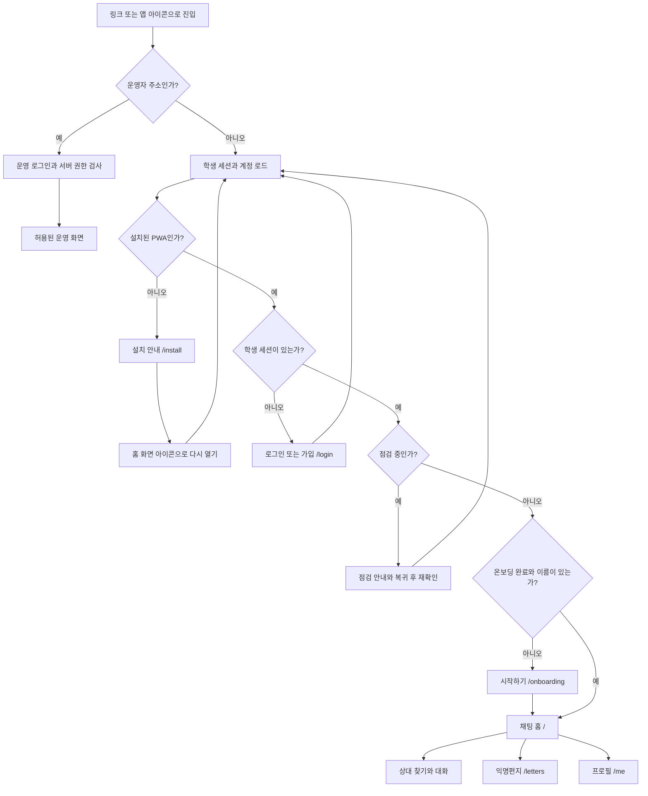
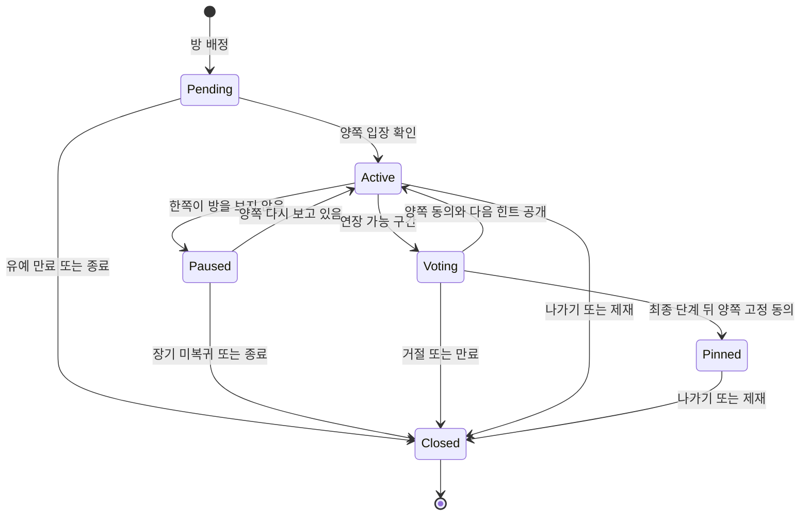
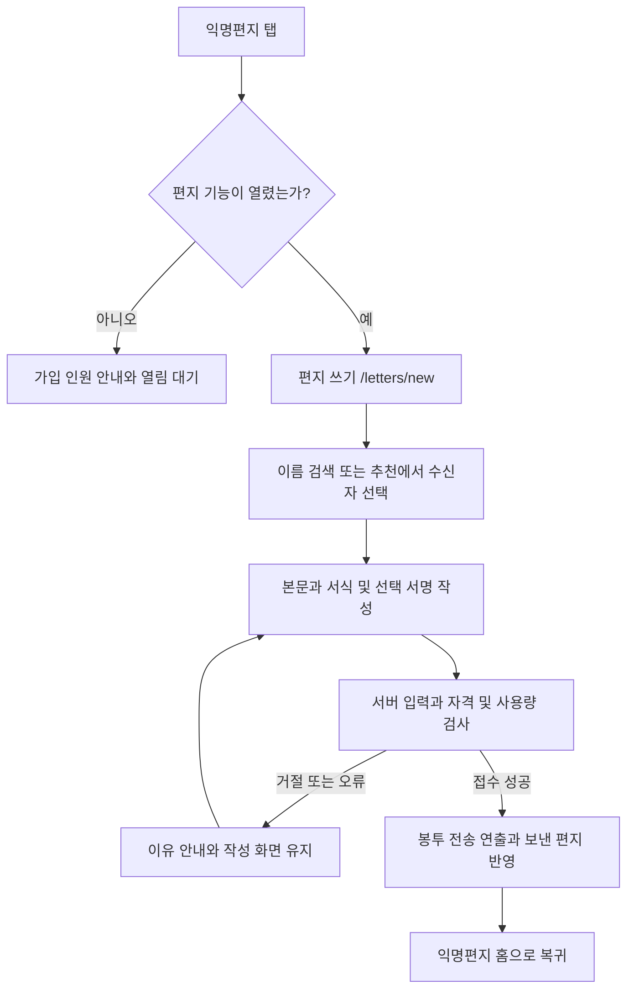
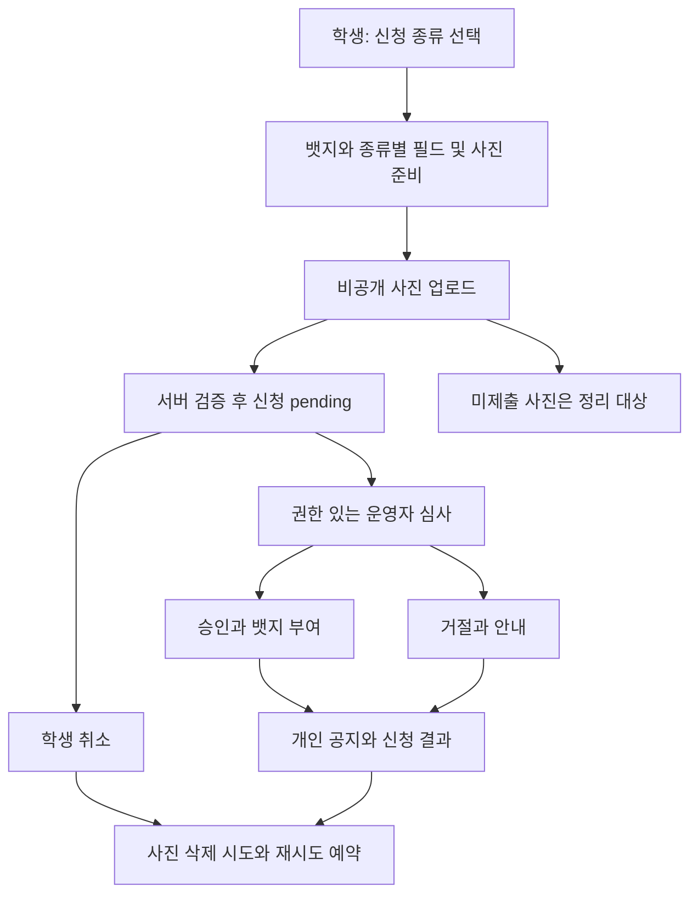

# Landy 유저 플로우 · 화면 및 상태 명세

작성일: 2026-10-03 (KST) · 기준 커밋: `8d8dabd` · 기준 요구사항: [PRD.md](./PRD.md)

이 문서는 실제 라우트·컴포넌트·DB 상태를 바탕으로 학생과 운영자의 주요 과업을 정리한다. **정상 경로는 현재 구현**, ‘보완’은 구현 공백 또는 앞으로 충족할 요구사항이다. 운영 설정·실기기 테스트로 모든 경로를 검증했다는 의미는 아니다. FR/NFR 번호는 PRD와 연결하며 개선 R 번호는 [종합 검토](./PROJECT-REVIEW-2026-10-03.md)를 가리킨다.

## 1. 전체 진입 구조

도식은 사용자가 볼 수 있는 진입 경계를 요약한다. 실제 root layout은 세션/프로필 로드 중 splash를 보여 주고, 점검 안내는 로그인 세션이 있을 때 학생 화면을 덮는다. 직접 들어온 주소는 항상 복구되는 것이 아니다. 미로그인/미온보딩 딥링크 목적지 보존은 전 경로에서 보장되지 않으므로 UF-13에서 보완 사항으로 둔다.

### 공통 탐색 규칙

| 상황 | 현행 동작/요구 |
|---|---|
| 학생 루트 세 화면 | 하단 익명편지·채팅·프로필 탭. 탭 이동은 기록 교체와 스크롤 보존 |
| 대화방·편지 작성/상세·설정·알림 | 하단 탭을 숨기고 뒤로가기로 상위 화면 복귀 |
| 시트·봇·안내 창 | 닫을 수 있는 최상위 창부터 뒤로 닫음. 창에서 다른 화면으로 이동은 overlay 전용 이동 |
| 편지·프로필 탭에서 Android 뒤로 | 채팅 홈으로. 홈에서는 두 번 누르면 종료 동작 |
| 매칭 중 홈 이탈 | 앱 안 이동에서는 찾기 유지. 편지·프로필 탭에 대기·취소 표시. 계정 변경·앱 레이아웃 이탈 시 정리 |
| 오프라인 | 공통 표시. 쓰기는 서버 결과로 확정하고 복귀 후 상태를 재조회 |
| 로그아웃/계정 전환 | 계정 세대 변경·화면 재생성으로 이전 데이터/응답 격리 |

## 2. 플로우 목록

| ID | 사용자 과업 | 진입점 | PRD |
|---|---|---|---|
| UF-01 | 설치·첫 진입 | 링크/앱 아이콘 | FR-01/05 |
| UF-02 | 신규 가입·온보딩 | `/login` 가입하기 | FR-02/03 |
| UF-03 | 재로그인·비밀번호 분실/변경 | `/login`, `/settings#password` | FR-02/04 |
| UF-04 | 새 상대 찾기 | `/` 찾기 | FR-06/07 |
| UF-05 | 입장·대화·연장·고정·종료 | `/chat/[id]` | FR-08~12 |
| UF-06 | 신고·차단·나가기 | 방/편지 메뉴 | FR-25/26 |
| UF-07 | 대상 검색·새 익명편지 보내기 | `/letters/new` | FR-13~17 |
| UF-08 | 봉투 열기·답장 | `/letters`, `/letters/m/[id]` | FR-16/17 |
| UF-09 | 보관·폴더·내 편지 삭제 | `/letters/archive`, `/letters/f/[id]` | FR-18~20 |
| UF-10 | 프로필·대표 업적 편집 | `/me`, `/me/achievements` | FR-21/22 |
| UF-11 | 뱃지 증빙 제출·심사·결과 | `/me/achievements/submit` | FR-23/24 |
| UF-12 | 공지·개인 공지·문의 확인 | `/activity`, `/settings/contact` | FR-29 |
| UF-13 | 알림·딥링크로 복귀 | Push/앱 안 알림 | FR-28, NFR-07 |
| UF-14 | 설정·로그아웃·삭제 요청 | `/settings` | FR-04/05/31 |
| UF-15 | 운영 로그인·신고 검토·제재 | `/admin/login`, `/admin` | FR-32~34 |
| UF-16 | 운영 설정·점검·권한 관리 | `/admin/settings`, `/admin/staff` | FR-35~37 |
| UF-17 | 매칭 대기 중 AI 대화 | 홈의 봇 창 | FR-30 |

## UF-01 — 설치와 첫 진입

**목표:** 학생이 자기 기기에서 실행 가능한 앱을 열고 인증 단계로 이동한다.

1. 배포 링크를 연다. 학생 앱의 세션/설정을 초기화하는 동안 splash가 나타난다.
2. standalone이 아니면 `/install`로 이동한다.
3. 인앱 브라우저면 Safari/Chrome에서 열기 또는 링크 복사를 안내한다. Android의 설치 권장 브라우저 분기도 존재한다.
4. iOS는 홈 화면 추가 절차, 지원 Android 브라우저는 설치 프롬프트/수동 안내를 따른다.
5. 홈 화면 앱 아이콘으로 다시 연다. 세션이 없으면 `/login`, 있으면 계정 로드와 온보딩 상태를 판단한다.

| 예외 | 결과·복구 |
|---|---|
| 설치 취소 | 취소 안내 후 설치 페이지 유지, 재시도 가능 |
| 외부 브라우저 열기 실패 | 링크 복사/수동 열기 안내 |
| Supabase 공개 설정 누락 | 개발/배포 설정 필요 화면. 사용자가 학번을 반복 입력하는 경로로 보내지 않음 |
| 초기 데이터 조회 실패 | 현재 부팅 복구 공백(R02). 목표는 오류 설명과 같은 계정 재시도 |

**설치 전 체험:** `/welcome`은 설치·로그인 없이 샘플 대화·편지와 익명 범위를 확인할 수 있다. `/install`에 진입 링크가 있다. 샘플은 실제 학생·DB·AI와 통신하지 않는다. 실제 학생 기능의 설치/인증 가드는 유지한다.

## UF-02 — 신규 가입과 온보딩

**시작 조건:** 설치된 앱, 로그인 세션 없음. **완료:** 학교 이메일 인증과 첫 설정 후 채팅 홈.

1. `/login`에서 ‘처음이에요 · 가입하기’를 고른다.
2. 학교 이메일 앞부분에 학번을 적는다. UI는 `1~3`으로 시작하는 5자리 숫자를 검사하고 학교 도메인을 고정 표시한다.
3. 인증 코드를 요청한다. 보낸 이메일·스팸함 안내와 재전송 60초 카운트다운을 표시한다.
4. 메일에서 코드를 받아 입력한다. UI는 6~8자리, 실제 길이·만료는 Auth 설정을 따른다.
5. 인증 성공 후 계정/설정을 읽고 `/onboarding`으로 이동한다.
6. 학교 명단에 이름이 있으면 확인한다. 없으면 실명을 한 번 입력한다. 명단 이름을 직접 바꾸거나 다른 명단 이름을 사용하는 경로는 제한된다.
7. 비밀번호가 없으면 새 비밀번호·확인 값을 입력한다. 성별과 대화 상대 선호(남/여/무관)를 각각 직접 고른다. 성별 선택은 선호를 자동으로 채우거나 변경하지 않는다.
8. 상대·운영자에게 보이는 정보와 기본 안전 규칙을 읽고 ‘동의하고 시작하기’를 누른다. 필요한 이름/비밀번호/프로필 저장이 성공하면 `/`로 이동한다.
9. 홈/프로필/편지에 첫 방문 안내가 순차 제공되며 건너뛰기·설정에서 다시 보기를 지원한다.

| 예외 | 결과·복구 |
|---|---|
| 잘못된 학번 또는 영어 계정 | 학번 형식/학생 전용 안내, 코드 요청 비활성 |
| 메일 실패·요청 한도 | 오류 안내, 잠시 후 재요청. 학교 공용 IP 운영 한도는 별도 확인 |
| 코드 불일치/만료 | 실패 안내와 재입력·재전송 |
| 이름/비밀번호/성별 미완료 | 시작 비활성. 남은 조건 설명은 UX 수용 기준 |
| 이름 저장 성공 후 다른 저장 실패 | 온보딩 미완료 상태에서 다시 시도. 부분 저장을 가입 전체 실패/완료로 잘못 설명하지 않음 |
| 이미 온보딩했으나 이름 없음 | 이름만 묻는 분기로 진입 |

**정책:** 이메일 인증은 학교 메일 접근을 확인한다. UI의 학생 학번 형태 검사가 DB의 모든 직접 가입 경로까지 같은 자격 검증을 보증하는 것은 아니다. 근거: login, onboarding, state 및 학교 도메인/계정 선점 방지 SQL trigger.

## UF-03 — 로그인, 분실 복구와 비밀번호 변경

**재로그인:** `/login` → 학번·비밀번호 → 서버 인증 → 계정 로드 → 온보딩/이름 미완료면 시작하기, 완료면 홈. 틀린 비밀번호는 오류를 알리고 다시 입력한다.

**분실 복구:** ‘비밀번호를 잊었어요’ → 기존 계정에 인증 코드 요청 → 코드 확인 → `/settings#password` → 새 비밀번호와 확인 → 저장. 미온보딩이면 root guard가 온보딩을 우선할 수 있다.

**설정에서 변경:** `/settings`의 비밀번호 열기 → 현재 비밀번호 재확인 또는 인증 코드 경로 → 새 비밀번호/확인 → 저장 결과. 비밀번호가 없는 계정에는 생성 경로가 있다.

| 예외 | 결과·복구 |
|---|---|
| 계정 없는 이메일의 분실 요청 | 새 계정을 임의로 만들지 않고 Auth 결과 안내 |
| 재확인 실패 | 새 비밀번호 저장 전 단계 유지 |
| 8자/영문·숫자 또는 확인 불일치 | 입력 조건 설명, 저장 불가 |
| 인증 완료 뒤 저장 실패 | 성공 안내하지 않고 재시도. 재확인 유효기간을 서버 정책과 맞춤 |

**보완:** 클라이언트 재확인 화면만으로 서버에 직접 보내는 password update를 제한할 수는 없다. Auth의 실제 재인증 설정 확인은 R08이며 보장된 구현으로 적지 않는다.

## UF-04 — 랜덤 상대 찾기

**시작 조건:** 채팅 홈, 새 대화를 시작할 자격과 일반 대화 여유 있음.

1. `/`에서 ‘새 상대 찾기’를 누른다. 찾기 상태와 경과 시간을 보여 준다.
2. 서버는 계정 상태·학교 인증·온보딩·서비스 운영·점검·동시 대화 상한을 검사하고 대기 상태를 갱신한다.
3. 서로 맞는 성별 선호, 차단 및 재매칭 규칙을 적용해 상대를 찾는다.
4. 상대가 없으면 기다린다. 초기/장기 대기에 맞춰 폴링 간격을 늘리고 백그라운드에서는 요청을 멈춘다.
5. AI 기능이 켜져 있고 20초가 지나도 상대가 없으면 UF-17을 병행할 수 있다.
6. 방이 배정되면 매칭 피드백을 보여 주고 `/chat/[id]`로 이동한다. 봇/시트 위에서 이동하면 그 창의 기록을 대화방으로 바꾼다.

| 서버/사용자 결과 | 다음 상태 |
|---|---|
| waiting: empty/filtered | 대기 유지. 필터에 맞는 상대가 없다는 상태와 오류 구분 |
| busy/retry/cooldown | 지정 간격 뒤 재요청, 연타 제한 안내 |
| full | 찾기 종료·현재 대화 상한 설명 |
| not_eligible/제재 | 찾기 중단·자격/이용 제한 안내 |
| service_closed/점검 | 찾기 중단·운영 안내 또는 공통 점검 화면 |
| 직접 취소 | 서버 대기 취소, 홈 목록 유지 |
| 홈 이탈/앱 숨김 | 앱 안 이동 중 찾기 유지. 다른 탭에서 매칭되면 방으로 이동. 숨김은 요청 중단·서버 TTL로 대기 해제 |

**완료 기준:** 중복 배정 없이 한 방의 두 seat가 만들어지고, 취소/상한/닫힘 뒤에도 UI가 계속 ‘찾는 중’으로 남지 않는다. 탭 이동 중 유지 여부는 D-02. 근거: 홈, seeker/pollSeeker, request_match.

## UF-05 — 입장, 대화 시계, 연장과 고정

DB의 room status는 pending/active/closed다. Paused·Voting은 사용자 경험의 하위 상태, Pinned는 속성이며 별도 status 값이 아니다. pause 상태에서는 남은 시간과 서버의 viewing 유효기간을 기준으로 다시 동기화한다.

1. 배정된 방에 들어가 상대 익명 이름과 소개를 확인하고 입장을 승인한다.
2. 양쪽 입장 전에는 기다린다. 유예가 지나면 no_show로 닫힌다.
3. 양쪽 입장 후 첫 대화가 시작된다. 현재 기본 5분이며 양쪽이 방을 보고 있을 때만 흐른다.
4. 본문·첫마디·공감·인용 답장을 사용한다. 본인 메시지는 전송 UUID로 먼저 표시하고 서버 응답/실시간 방송을 병합한다.
5. 한쪽이 방 화면을 떠나면 시계를 정지한다. 재입장/백그라운드 복귀 시 서버 snapshot으로 남은 시간과 메시지를 복구한다.
6. 만료 90초 전 구간에 연장 여부를 정한다. 필요한 힌트/공통 질문 답을 입력·선택한다.
7. 양쪽 동의면 기본 10분 연장과 다음 정보 공개. 한쪽 거절이면 종료, 미응답으로 시간이 지나도 종료한다.
8. 공개는 학년 → 질문1 → 디플로마 → 질문2 → 동아리 순서다. 정보가 없으면 비공개로 보일 수 있으며 성씨 공개를 현행 단계로 설명하지 않는다.
9. 다섯 단계 이후 다음 연장 구간에 양쪽이 동의하면 고정 대화가 된다. 홈의 고정 목록으로 다시 열고 시간 제한 없이 이어간다.
10. 만료/나가기/차단/신고/제재로 닫히면 종료 이유와 홈/새 찾기 행동을 제공한다. 자격이 있으면 매너 평가를 할 수 있다.

| 예외 | 처리 |
|---|---|
| 메시지 금칙어/신상정보 | 저장 거절, 이유/편집 또는 복구. 자기 신원을 밝히는 입력도 필터 대상 |
| 전송 유실/중복 | 같은 UUID 재시도와 DB 확인으로 확정. 서버 확정 메시지를 늦은 실패로 되돌리지 않음 |
| 소속 아닌 방/잘못된 주소 | 실제 없음·권한 없음 상태. 네트워크 오류와 구별 |
| 재연결 | 빠진 메시지·방/투표/공감 상태 동기화 |
| 힌트 미입력/허용하지 않는 디플로마 | 동의 확정 전에 조건 안내 |
| 연장 상한/이미 고정/이미 종료 | 서버 결과로 버튼과 상태 갱신 |

**보완:** 긴 고정 대화는 전체 기록 로드/렌더링(R13), 종료 뒤 신규 Realtime 참여는 R29. 평가 결과는 즉시 공개하지 않고 지연 반영한다.

## UF-06 — 신고, 차단과 나가기

**진입:** 대화방·홈 대화 메뉴 또는 편지 메뉴. **목표:** 불편한 접촉을 끝내고 필요한 검토를 요청한다.

| 행동 | 현행 의미 | 사용자에게 보여 줄 결과 |
|---|---|---|
| 채팅 나가기/넘기기 | 방을 닫음. 차단이나 신고를 뜻하지 않음 | 종료 확인 후 홈 또는 새 상대 찾기 |
| 편지 버리기 | 내 쪽 목록에서 숨김/끝내기. 수신자의 거절은 향후 그 발신자의 전달 억제로 이어짐 | 해당 편지를 더 받지 않는 효과를 설명 |
| 차단 | 두 계정 사이 접촉을 제한하고 기존 랜덤채팅도 닫음 | 본인에게 성공 확인, 상대 신원/차단 사실의 추론 단서는 주지 않음 |
| 신고 | 사유/메모, 증거 사본·접수·자동 차단·끝내기. 누적 조건 시 자동 제재 | 접수 확인과 사용자에게 필요한 다음 행동 |

1. 메뉴에서 행동을 고른다. 되돌리기 어려운 행동에는 확인, 신고에는 사유·선택 메모를 제공한다.
2. 서버가 본인 참여/편지 접근과 현재 상태를 검사한다.
3. 성공 후 종료 상태를 반영하고 필요하면 홈으로 돌아간다. 신고자 신원은 상대에게 공개하지 않는다.
4. 실패하면 기존 화면과 입력을 유지하고 다시 시도할 수 있어야 한다.

**보완:** 채팅 나가기에는 실패를 삼키고 시트를 먼저 닫는 경로(R07)가 있다. 실패→완료 표시를 금지하는 것은 수용 기준이며 이미 모든 경로가 충족한다고 적지 않는다. 신고 사유의 낭독기 선택 상태/메모 label은 R20. 차단은 랜덤채팅과 편지에 공유되므로 이용자에게 전체 효과를 알린다.

## UF-07 — 수신 대상 검색과 익명편지 전송

1. `/letters`에서 잠금 조회 중/닫힘/열림을 판단한다. 기본 잠금 기준은 인증·온보딩 학생 100명이며 설정값을 표시한다.
2. 편지 쓰기로 들어가 이름을 두 글자 이상 검색하거나 최대 5명의 추천에서 선택한다.
3. 결과의 이름·학년·학번·대표 뱃지로 동명이인을 구분한다. 검색은 최대 10명이다.
4. 수신자를 고른 뒤 편지지에서 최대 1,000자 본문·허용 서식·선택 서명을 적는다. 수신자 재선택은 작성 화면의 뒤로 동작과 연결된다.
5. 보내기를 누르면 DB가 자격·잠금·본문/서식/서명·한도를 검사한다.
6. 접수 성공이면 봉투 연출을 마치고 ‘편지를 보냈어요’와 보낸 편지 상태를 반영한 뒤 편지 홈으로 돌아간다.

| 예외 | 결과·복구 |
|---|---|
| 2글자 미만/검색 결과 없음 | 입력 안내 또는 결과 없음. 오류와 구분 |
| 받기를 끈 대상/현재 대상 없음 | 선택/전송 가능한 대상이 아님을 안내 |
| 잘못된 본문/서식/서명 | 해당 조건 안내, 작성 내용 유지 |
| 사용량 제한/답장 대기 | 다음 가능 시점 또는 상대 답장 기다리기 안내 |
| 차단·수신 거부·수신자 제재 | 서버는 발신 결과의 차이로 신원을 추론하지 못하도록 접수/보낸 편지는 유지하되 전달을 막을 수 있음 |
| 네트워크 오류 | 전송 성공 연출을 마무리하지 않고 재시도 가능 |

**익명성 주의:** 검색 대상 id는 편지의 수신 대상을 지정하는 데 쓰인다. 그 사실은 랜덤채팅 상대 id나 편지 발신자 id를 노출해도 된다는 뜻이 아니다. 발송 접수를 배달/읽음 확인으로 바꾸지 않는다.

**보완:** 초안 자동 저장은 아직 공백(R03). 가입 통계 오류 때 잠금 기본값은 R24. 추천 조회 실패를 빈 추천으로 처리하는 경로는 NFR-03 기준에 맞춰 별도 오류 안내가 필요하다.

## UF-08 — 새 봉투 열기와 답장

**진입:** 우체통의 새 편지, 보관함의 한 통, 알림 주소 `/letters/m/[id]`.

1. 본인에게 보이는 편지를 서버에 요청한다. 남의 편지/전달되지 않은 편지/제거된 접근은 열리지 않는다.
2. 처음 열어 보는 받은 편지면 우체통→봉투→봉인→편지지 연출을 진행한다. 다시 읽는 편지에는 재열기 상태를 적용한다.
3. 첫 열기를 서버에 반영하고 편지함의 안 읽은 수·열림 표시를 갱신한다.
4. 수신자는 발신 시 성별/선택 서명과 본문을 본다. 계정 이름·이메일은 보지 않는다.
5. 답장을 고르면 `/letters/m/[id]/reply`로 이동한다. 원래 익명 발신자는 원래 수신자의 이름을 알고, 원래 수신자는 익명 상대의 신원을 계속 모른다.
6. 본문/서식/필요한 서명을 작성하고 UF-07과 같은 서버 승인·전송 경로를 따른다.

| 예외 | 결과·복구 |
|---|---|
| 삭제/운영 제거/권한 없음 | 열 수 없는 상태와 상위 편지함 이동 |
| 네트워크 로드 실패 | 실패 안내와 재시도. 없음으로 단정하지 않음이 목표 |
| 답할 수 없는 상태/제재/잠금 | 작성 또는 전송 차단, 서버 결과 안내 |
| 연출 중 알림 이동·뒤로 | 최상위 창/화면 정리, 다음 진입에서 서버 열림 상태 복구 |

**완료 기준:** 열지 않은 수와 서버가 일치하고, 답장에도 발신자 추론을 허용하는 데이터가 추가되지 않는다. 연출 선호/reduced motion을 반영하고 첫 읽기와 배달을 동일한 상태로 표현하지 않는다.

## UF-09 — 보관함, 개인 폴더와 삭제

1. 편지 홈에서 보관함 `/letters/archive`로 들어가 받은/보낸 편지를 확인한다.
2. 편지 한 통을 열거나 ‘선택’으로 여러 통을 고른다. 받은 편지의 이동/삭제는 열어 본 편지만 허용한다.
3. 기존 폴더 또는 새 이름을 선택해 이동한다. 개인 폴더 목록/편지 수를 갱신한다.
4. `/letters/f/[id]`에서 전체/받은/보낸 보기, 더보기, 폴더에서 빼기, 다른 폴더로 이동, 이름 변경을 제공한다.
5. 폴더를 삭제하면 그 안의 편지는 보관함으로 돌아간다.
6. 내 편지 삭제를 확인하면 내 편지함/폴더에서 숨긴다. 상대 편지와 thread 자체를 삭제하는 동작은 아니다. 새로운 답장이 계속 올 수 있다.
7. 선택 중 뒤로는 선택을 끝낸다. 다음 뒤로가기가 상위 화면으로 이동한다.
8. 편지 이미지 공유는 사용자가 선택한 외부 공유/저장 경로로 진행한다. 앱 밖으로 나간 내용의 공개 범위를 별도로 설명해야 한다.

**예외:** 내 것이 아닌 폴더/편지는 접근 거부, 이름 중복/20자 초과/폴더 상한은 조건 안내. 이동·삭제 실패 시 서버 결과로 목록을 복구한다. 동시 폴더 생성은 R28, 과도한 전체 재조회는 R16. ‘내 편지 삭제’, ‘폴더 삭제’, ‘버리기’, ‘차단’의 의미를 한 개의 삭제 버튼으로 합치지 않는다.

## UF-10 — 프로필과 업적

**편집:** `/me` → 익명 이름·매너 온도 확인 → 소개(60자)·관심사(5개)·MBTI 선택 → 저장 → 서버 검증/성공 표시. 매칭 선호는 별도 선택 변경 경로다.

**업적:** 교복의 뱃지/업적 수 → 상세·획득 조건 → 대표로 걸기/내리기 → 원하는 칸에 재배치. 기본 3칸, 자격을 충족하면 5칸이다. 새 업적 축하는 탭 루트에서 표시된다.

**공개 범위:** 랜덤채팅 뱃지별 표시 선호와 편지 검색의 순서(내 순서/무작위)를 설정에서 관리한다. CNSA 뱃지가 채팅 신원 추론 단서가 될 수 있음을 안내한다.

**예외/보완:** 금칙어/신상정보·잘못된 태그는 서버 거절, 실패 시 편집 내용 유지가 목표. 소개 자동 초안은 R03, 대표 뱃지의 연속 재배치 응답 역전은 R15. 기기 테마는 상대 화면을 바꾸지 않는다. 이름 변경 기능을 프로필 자유 편집 기능으로 그리지 않는다.

## UF-11 — 뱃지 제출부터 심사 결과까지

1. `/me/achievements/submit`에서 기존 뱃지 인증(proof), 동아리 기장(club), 새 뱃지(new) 중 고른다.
2. 기존 뱃지는 신청 가능한 정의를 선택한다. 동아리는 기존 코드 또는 새 동아리 이름·부원 학번을 입력한다. 새 뱃지는 이름·설명을 입력한다.
3. 사진 1~3장을 고르고 축소/변환한 미리보기를 확인한다. 본인 인증 정보가 포함될 수 있으므로 공개 사진처럼 취급하지 않는다.
4. 본인 경로의 비공개 Storage에 업로드하고 신청한다. 서버는 계정 상태·종류별 입력·실제 사진·quota·cleanup lease를 검사한다.
5. 신청 목록에서 pending 상태를 확인한다. pending은 본인이 취소할 수 있다.
6. `identity` 권한이 있는 운영자가 `/admin/badge-requests`에서 사진·요청을 검토한다. 일반 신고 처리 권한만으로 사진을 열지 않는다.
7. 승인하면 해당 학생/검증한 부원에게 뱃지를 부여하고, 거절이면 설명을 남긴다. 결과는 신청 목록과 개인 공지로 전달한다.
8. 취소/결정 이후 사진 삭제를 시도한다. 실패하면 경로·lease를 보존해 예약 작업에서 재시도한다. 미제출 업로드도 정리 대상으로 남는다.

**예외:** 업로드/신청 상한·이미 보유·잘못된 code/부원·없는 사진·이미 예약된 사진은 거절한다. 업로드만 성공하고 신청이 실패한 파일은 즉시 완전 삭제되었다고 표시하지 않는다. 심사 중 signed URL 만료/표시 실패는 갱신/복구가 필요하다(R01). 원본 fallback 메타데이터는 R12, 실제 운영 cron과 사진 파기는 별도 확인 대상이다.

## UF-12 — 공지, 개인 공지와 문의

**공지/활동:** 상단 알림 아이콘 → `/activity` → 새 채팅/편지·전체 공지·개인 공지 확인 → 공지 상세 `/notices/[id]`, 편지/대화로 이동, 개인 공지는 화면에서 펼쳐 읽기. 과거 공지 목록 `/notices`는 `/activity`로 이동한다.

**문의:** `/settings/contact` → 이용/안전/계정/버그/기타 종류 → 본문 → 제출 → 본인 문의 목록의 대기 상태 → 운영자의 답변 → 문의 목록과 개인 공지에서 확인. 답변은 푸시 조건을 충족하면 알림으로도 전달된다.

**운영 답변:** `/admin/inquiries` → 권한 검사 → 미답변 검토 → 답변 작성 → 저장/개인 공지 → 학생 확인.

**예외:** 미응답 3건·최근 하루 5건 상한, 본문 길이/네트워크 실패는 화면에 안내한다. 문의 목록 조회 실패를 빈 목록으로 처리하는 현재 경로는 NFR-03 보완 대상이다. 지워진 공지·이미 답변한 문의·권한 없는 답변을 각각 구분한다. 신고는 증거·차단을 포함하므로 일반 문의와 동일한 처리로 합치지 않는다.

## UF-13 — 알림 및 딥링크 복귀

1. 사용자 동의에 따라 푸시를 켠다. 거절/미지원 상태여도 채팅·편지는 사용할 수 있다.
2. 서버는 수신 기기·종류별 mute·보고 있는 방·접수 중복 조건을 판단해 알림을 전송한다.
3. 앱 실행 중에는 상황에 따라 앱 안 알림 띠를 표시한다. 현재 보고 있는 대화는 별도로 거른다.
4. 알림을 누르면 같은 출처의 대화/편지/활동 주소를 연다. 앱 세션·온보딩·점검 가드는 다시 적용된다.
5. 권한 있는 목적지가 열리면 새 항목을 읽고, 뒤로는 앱 밖으로 종료되지 않고 홈/상위 목록으로 돌아가는 것이 요구사항이다.

| 예외 | 결과·복구 |
|---|---|
| 로그아웃/세션 만료 | 로그인으로. 현재 모든 딥링크가 로그인 뒤 원래 대상까지 복구된다고 보증할 수 없어 목적지 보존 검증 필요 |
| 온보딩/이름 미완료 | 시작하기를 우선. 완료 뒤 목적지 복원 요구를 함께 결정 |
| 종료된 방/숨긴 편지/없는 공지 | 볼 수 없는 상태와 홈/목록 행동 제공 |
| 권한 거절/푸시 실패 | 알림에 의존하지 않고 앱 목록에서 확인 |
| 점검 | 공통 안내 후 복귀 시 서버 상태 다시 확인 |

**보완:** Push 로그가 발송 성공/재시도를 완전히 표현하지 않는 R06과 구버전 앱 셸 R17이 이 경험에 연결된다. 수신자에게 표시할 제목/본문/잠금 화면 미리보기의 공개 범위도 제품 안내에서 확인해야 한다.

## UF-14 — 설정, 로그아웃과 삭제 요청

1. `/settings`에서 표시 모드·테마·글자 크기·움직임·진동·편지 글씨/연출·Enter 동작·앱 안 알림을 조정한다. 주로 기기 저장 설정이다.
2. 편지 받기/추천 포함 여부·뱃지 표시 순서/채팅 표시, 계정 관련 값은 서버 저장 범위를 확인한다.
3. 푸시를 켜거나 해제하고 종류별 mute를 바꾼다. 기기 구독을 다른 계정에 그대로 남기지 않는다.
4. 약관/개인정보/운영정책을 읽거나 문의로 이동한다. 사용법 안내 다시 보기와 표시 설정 초기화를 제공한다.
5. 로그아웃 확인 → 세션 종료·계정 캐시 격리 → `/login`. 표시 설정 초기화와 로그아웃은 계정 삭제가 아니다.
6. `/settings/delete`에서 안내 확인 후 삭제 요청을 기존 계정 문의로 접수한다. 내 요청과 운영진 답변을 확인하고, 대기 중 중복 요청을 막는다. 조회·전송 실패는 재시도할 수 있다. 요청 철회는 계정 문의로 전달한다. 접수·답변 도착은 실제 삭제 완료를 뜻하지 않는다.
7. 운영진방 `/admin/inquiries`에서 admin 역할이 요청자·삭제 범위를 확인하고 사유·확인 문구·동의를 거쳐 실제 삭제한다. 계정과 편지·첨부는 삭제하고 대화를 종료하며 처리 내역·활동 기록을 남긴다. 부분 실패는 이용 제한을 유지하고 재시도한다. 삭제 후 학생은 앱에서 결과를 볼 수 없으므로 필요한 안내는 먼저 전달한다. 대화·신고 증거·명렬표·감사/처리 기록과 백업/내보낸 파일은 별도 보존 범위를 따른다.

**보완:** 기기 설정의 글자 크기가 앱의 모든 본문에 적용되지는 않으며 확대 제한은 R18. 탈퇴의 본인 확인·운영 담당·상대 편지/신고 증거/백업·파일 파기는 PRD D-04로 남긴다.

## UF-15 — 운영 로그인과 신고/제재

1. 일반 브라우저에서 `/admin` 또는 `/admin/login`을 연다. 학생 PWA 설치 상태는 요구하지 않는다.
2. 학교 계정/비밀번호로 로그인한다. 서버가 토큰을 검증하고 운영진 명단·역할/권한을 확인해 운영 쿠키를 발급한다. 학생 로그인은 독립적으로 유지한다.
3. 권한에 맞는 첫 화면으로 이동한다. 신고 권한이면 채팅 신고 `/admin`, 편지 신고 `/admin/letters`를 검토한다.
4. 사유·증거·상태를 확인한다. 추가 신원이 필요하면 `identity` 권한을 검사하고 접근 기록을 먼저 남긴 뒤 열람한다.
5. open → reviewing → actioned/dismissed 등 신고 상태를 변경하고, 필요하면 경고/기간 정지/영구 정지/해제를 적용한다.
6. 제재 범위는 역할의 제한을 따른다. 정지/영구정지 시 기존 열린 방을 닫고 매칭 대기를 해제한다.
7. 처리/열람 기록을 남기고 결과를 확인한다. 권한이 있으면 사용자 상세·전체 대화·CSV로 연결한다.

| 예외 | 처리 |
|---|---|
| 운영 명단에 없음/로그인 실패 | 운영 진입 거절 |
| 세션 만료/명단 해제 | 다음 요청에서 차단/로그인 경로 |
| 메뉴 없는 주소를 직접 요청 | 서버 및 DB에서 권한 검사, 403 |
| 신원 열람 기록 실패 | 신원 반환하지 않음 |
| moderator가 영구 정지/초과 기간 요청 | 역할 제한으로 거절. identity 위임 여부와 별개 |
| 탈퇴 사용자/이미 처리된 대상 | 서버 상태를 안내, 조치 완료로 오표시하지 않음 |
| 예상 밖 오류 | 짧은 오류 번호와 재시도/운영 로그 확인 |

**보완:** 개별 운영 세션 폐기는 R09, CSV 조회 시점·날짜는 R23. 이 플로우에서 일반 moderator에게 기본 신원 열람이나 전체 대화 접근을 부여하지 않는다. 최고 관리자의 권한표 변경으로 실제 권한은 달라질 수 있다.

## UF-16 — 서비스 설정, 점검과 운영진 관리

**서비스 열고 닫기:** `/admin/settings` → service 권한 확인 → 영향 확인 → 열기/닫기 저장 → 새 대화/편지 쓰기 시작 경계에 반영. 기존 방의 모든 기능을 즉시 종료하는 조치와 같은 것으로 설명하지 않는다.

**점검:** settings 권한 → 안내 문구·시작 시각/종료 안내 설정 → 지금 시작 또는 예약 → 학생의 heartbeat/복귀 조회에서 공통 점검 화면 → 운영자가 종료/예약 취소 → 학생 다음 확인에서 복귀. `maintenance_until`의 안내 시각이 자동 점검 해제를 보증하지는 않는다.

**운영 수치:** 시간·상한·AI·금칙어·편지 잠금·배너 등을 변경 → 서버 검증/기록 → 새 요청의 정책 반영. 진행 중인 세션의 적용 시점은 항목별로 확인한다.

**운영진 관리:** owner → `/admin/staff` → 대상 학번/역할/표시 이름으로 추가·변경·해제 → 기록 → 대상의 다음 요청부터 명단/권한 확인. 역할별 권한 체크를 변경할 수 있지만 owner 자신의 해제/일반 운영자의 권한 위조는 허용하지 않는다.

**보완:** 점검을 우회하는 직접 AI 요청은 R25, 종료 뒤 channel 신규 권한은 R29. 설정 저장만으로 Worker cron·DB cron·Auth 설정·secret이 모두 바뀌었다고 표현하지 않는다. 운영진이 없어진 상태·owner 부재 복구는 관리 절차가 필요하다.

## UF-17 — 매칭 대기 중 AI 봇

1. 홈에서 사람 찾기를 시작한다. AI 기능이 켜져 있고 대기가 20초 이상이면 ‘AI와 대화하기’ 버튼을 표시한다. 사용자가 직접 누르기 전에는 봇 시작을 요청하지 않는다.
2. 서버가 활성 설정·개인/전체 예산·기존 세션 여부를 확인한다. 시작 거절이면 사람 찾기를 계속한다.
3. 봇 창에 직접 선택한 AI이며 실제 학생이 아님을 표시한다. 학생은 짧은 메시지를 보내고 봇의 응답을 받는다. 사람 찾기는 공통 레이아웃에서 계속된다.
4. 서버가 턴 한도·세션 소유권·시간·제재·사용자 글 규칙을 검사하고 모델을 호출한다.
5. 사람과 매칭되면 봇 창을 접고 실제 방으로 이동한다. 봇만 닫아도 찾기는 유지되고, 다시 직접 선택해야 봇을 연다.
6. 시간/턴 종료 또는 기능 off/제한이면 봇을 종료하고 현재 상태를 알린다.

| 예외 | 처리/보완 |
|---|---|
| 글 규칙 위반 | 해당 글을 편집할 수 있도록 돌려주고 이유 안내 |
| 모델 장애/네트워크 실패 | 같은 기록 한 번 재시도. 이후 실패는 안내/일시 중단 또는 종료 |
| 재시도 중 닫힘/사람 매칭 | 이후 요청/늦은 답을 현재 창에 반영하지 않음 |
| 점검·온보딩 전 직접 요청 | 현재 DB 검사 공백(R25); 목표는 제품 자격과 동일하게 차단 |
| 같은 턴 재요청 | 현재 새 턴으로 셀 수 있음(R26); 목표는 요청 id로 중복 방지 |

AI 원문은 클라이언트 대화 기록에서 호출 시 전달하며 DB에 영속 저장하지 않는 정책이다. 사용량 메타데이터가 전혀 없다는 뜻은 아니다. 사람/운영자 또는 전문 상담 기능으로 오인시키지 않는다.

## 3. 상태별 화면 수용 기준

다음은 UX 가이드에서 가져온 **목표 기준**이다. 현재 코드의 모든 화면이 구현 완료된 상태표는 아니다.

| 상태 | 채팅/매칭 | 편지/프로필 | 운영 화면 |
|---|---|---|---|
| loading | 목록 모양 skeleton·입장/연결 상태 | 봉투/목록/폼 로드 상태 | 데이터 로드와 처리 중 버튼 |
| empty | 열린 대화 없음·새 상대 찾기 | 새 편지 없음·쓰기, 검색 결과 없음 | 처리 대상 없음·필터 변경 |
| error | 연결 문제·재시도, 종료/없음과 구분 | 읽기/저장 실패·내용 유지 | 권한 부족/조건 오류/예상 밖 오류 구분 |
| offline | 공통 안내·확정 전송 상태 복구 | 접수 성공으로 오표시하지 않음 | 실패한 조치를 다시 검토하고 제출 |
| restricted | 제재 이유/기간에 맞는 안내 | 신규 쓰기 거절·문의 경로 | 운영 역할별 권한과 제재 제한 |
| maintenance | 공통 점검 안내·복귀 재조회 | 일반 학생 화면 가림 | 권한 있는 운영자는 점검 종료 가능 |
| success | 실제 서버 확정 결과 | 보내기/읽음/보관/저장 구분 | 감사 기록 및 반영 결과 |

## 4. 과업별 검증 시나리오

| 시나리오 | 기대 결과 | 연결 요구사항 |
|---|---|---|
| 새 학생이 첫 OTP에 실패하고 재전송 후 온보딩 | 가입이 끝나고 다시 비밀번호로 로그인 가능 | FR-01~04 |
| A 로그아웃 후 B 로그인·늦은 응답 도착 | A 정보/초안/알림이 B 화면에 나타나지 않음 | FR-05, NFR-01/02 |
| 매칭 대기 중 탭 이동·앱 숨김·재진입 | 선택한 지속/취소 정책대로 상태와 안내 일치 | FR-07, D-02 |
| 양쪽 입장·한쪽 이탈·재입장·만료 | 실제 보고 있는 시간과 서버 상태 일치, no_show/paused/expired 구분 | FR-08/10 |
| 연장 한쪽 동의/거절·힌트 누락·최종 고정 | 동의 전 정보 비공개, 고정 상한 제외 | FR-10/11 |
| 메시지 접수 후 응답 유실·재전송 | 실제 메시지 한 개, 실패 상태가 확정을 덮지 않음 | FR-09 |
| 편지 차단 전후 검색·전송·안 읽은 수 비교 | 발신자가 익명 상대를 실명 계정에 연결하지 못함 | FR-14/17/26 |
| 긴 편지 작성 후 알림 이동·재시작 | 초안 보존 목표 확인, 현재 R03 공백을 회귀 사례로 남김 | FR-15, NFR-02 |
| 열지 않은 받은 편지/남의 폴더 이동·삭제 요청 | 서버 거절, 타인/미열람 편지 숨김 없음 | FR-18/19 |
| 뱃지 업로드 후 신청 실패·취소·삭제 API 실패 | 미제출 정리/재시도, 승인 사진 보호 | FR-23/24 |
| 푸시 거절·세션 만료 상태로 딥링크 | 핵심 사용 가능, 로그인/복귀 경로와 뒤로가기 명확 | FR-28, NFR-07 |
| 권한 없는 운영 주소·감사 실패·명단 해제 | 접근/신원 반환 거절, 다음 요청 차단 | FR-32/34/37 |
| 예약 점검 이후 직접 AI 요청 | 모델 호출 전에 차단하는 목표 검증 | FR-30/36, R25 |
| 실제 PostgreSQL 복수 연결의 quota/폴더/첫 편지 | 중복·초과/예상 밖 오류 없이 서버 불변식 유지 | NFR-01/06, R22/R28 |
| 360px·큰 글씨·다크·reduced motion·키보드·낭독기 | 주요 동작·입력·선택·뒤로가기·읽기가 가능 | NFR-04/07 |

## 5. 구현 근거와 유지 방법

- 진입/인증: [root layout](../src/routes/+layout.svelte), [login](../src/routes/login/+page.svelte), [onboarding](../src/routes/onboarding/+page.svelte), [state](../src/lib/state.svelte.ts).
- 탐색/overlay: [app layout](../src/routes/(app)/+layout.svelte), [nav](../src/lib/nav.ts), [overlay](../src/lib/overlay.svelte.ts), [tabBack](../src/lib/tabBack.svelte.ts).
- 채팅/봇: [홈](../src/routes/(app)/+page.svelte), [ChatRoom](../src/lib/chat/room.svelte.ts), [transport](../src/lib/chat/supabase-transport.ts), [bot conversation](../src/lib/bot/conversation.ts).
- 편지: [API](../src/lib/letters/api.ts), [gate](../src/lib/letters/gate.svelte.ts), [send](../src/lib/letters/send.ts), [Envelope](../src/lib/letters/Envelope.svelte), [mailbox](../src/lib/letters/mailbox.svelte.ts).
- 자기표현/심사/지원: [프로필](../src/routes/(app)/me/+page.svelte), [badgeRequests](../src/lib/badgeRequests.ts), [inquiry](../src/lib/inquiry.ts), [notices](../src/lib/notices.svelte.ts), [legal](../src/lib/legal.ts).
- 운영/실제 정책: [adminRoles](../src/lib/adminRoles.ts), [adminAuth](../src/lib/server/adminAuth.ts), [schema.sql](../supabase/schema.sql).

새 기능/경로/정책을 바꾸면 해당 UF의 시작 조건·정상 경로·예외·완료 결과와 연결 FR을 함께 갱신한다. DB 상태 이름과 화면 상태 이름을 구분하고, 삭제/차단·발송/전달·인증/온보딩·설정 저장/운영 배포를 서로 바꿔 쓰지 않는다.
